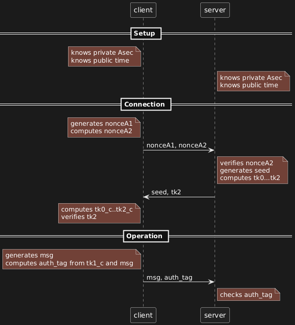
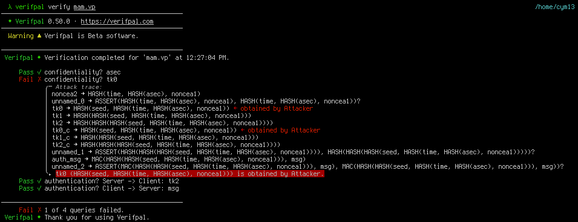
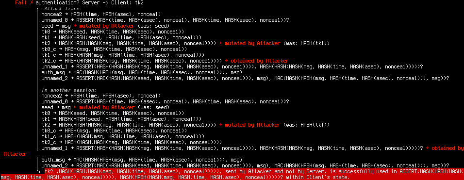
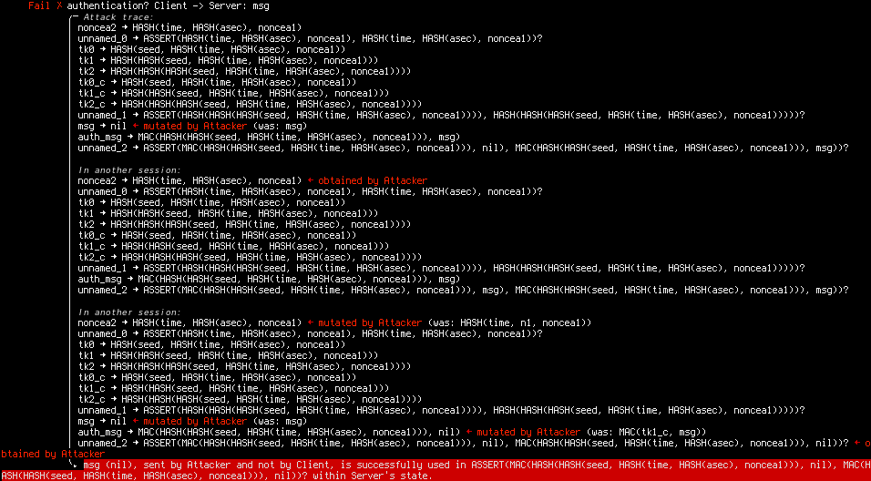

================================================
Breaking the Minimalist Authentication Mechanism
================================================

Context
=======

I stumbled on a paper from 2016 by António Pinto and Ricardo Costa titled
`Hash-Chain-Based Authentication for IoT
<https://revistas.usal.es/cinco/index.php/2255-2863/article/view/ADCAIJ2016544357/15950>`_
(https://doi.org/10.14201/ADCAIJ2016544357).
As the name suggests, it describes an authentication mechanism that involves
no encryption or asymmetric cryptography, a system they named Minimalist
Authentication Mechanism.

Now, there's no shortage of protocols being proposed in electronics and
computer engineering journals. But this one stood out to me because it
claims to be formally verified using `AVISPA
<https://www.ercim.eu/publication/Ercim_News/enw64/armando.html>`_, a
cryptographic protocol verification system that used to be more popular than
it is now. Yet, looking at the protocol, something didn't seem quite right.

Since `Verifpal <https://verifpal.com/>`_ (another cryptographic protocol
verification network) just got a full rewrite in rust, I thought it might be
a good opportunity to showcase some protocol modeling and analysis. If you
want to follow along without installing anything, don't hesitate to use its
online workbench!

The protocol
============

Hash-chain OTP
--------------

The idea of the protocol is to rely on hash-chain One-Time Passwords. The
concept is simple: a hash function is a one-way function, so given A it's easy
to compute HASH(A), but going from HASH(A) to A is essentially impossible. If
you start from a seed and compute a list of values by hashing your previous
output repeatedly, you'll get a deterministic sequence of hashes that is easy
to reproduce for anyone with the seed.

- seed
- HASH(seed)
- HASH(HASH(seed))
- ...

Now this list has an interesting property: given any value, it's easy to go
downward but it's impossible to go upwards. What you can do is use that list
of hashes as one-time use pre-shared secrets with someone that also knows the
seed by starting with the end of the list and using each hash once, going
upward until you reach the seed. This gives you an easy way to generate a
specific number of one-time passwords just by pre-sharing the seed.

The idea of MAM is to use such a list of OTP to authenticate communications
between a client and server. Since only hashing is required, this requires
less resources than encryption. However, while most messages need only to
include an identifier and OTP to be authenticated, you still need to safely
share the seed between client and server. And since the number of OTP
provided by this method is fixed, this seed exchange needs to happen
regularly and automatically.

This aspect of the protocol (called the login procedure in the paper) gives
us a window of attack, so that's what we'll study.

Login procedure
---------------

Algorithm 1 describes the server side of the login procedure.

.. code:: text

    Require: Pre shared secret Asec
        Receive (nonceA1,nonceA2) from A
        n1 ← Hash(Asec)
        n2 ← Hash(Time   : n1 : nonceA1)
        n3 ← Hash(Time−1 : n1 : nonceA1)
        n4 ← Hash(Time−2 : n1 : nonceA1)
        seed ← Hash(Random())
        if n2 = nonceA2 then
            tk0 ← Hash(seed : n2)
        else if n3 = nonceA2 then
            tk0 ← Hash(seed : n3)
        else if n4 = nonceA2 then
            tk0 ← Hash(seed : n4)
        end if
        if tk0 not NULL then
            for i = 1 to 512 do
                tki ← Hash(tki−1)
            end for
            return (seed,tk512)
        end if

Alongside the description in section 3, this will be our reference for how
this protocol works. We see that n3 and n4 serve the same function as n2,
they're there to extend the timeframe during which a token may be used. We'll
exclude them from our model.

To start, it's assumed that client and server share a long-term secret
Asec. We can also assume that they share their clocks are synchronized so
they share the same time. In the paper it's said that Time is a timestamp
rounded to 10 minutes which should make up for small differences.

So in Verifpal:

.. code:: javascript

   // Setup phase

    principal client [
        knows private Asec  // We assume Asec is not a guessable password
        knows public  time  // time is public knowledge
    ]

    principal server [
        knows private Asec
        knows public  time
    ]

The client initiates a connection by generating a random nonce (nonceA1) and
computing a hashed value named nonceA2 based on nonceA1 and Asec. It then
sends nonceA1 and nonceA2 to the server.

Remember that in this model, we don't care about the specific implementation
of cryptographic primitives such as hashing algorithms: HASH is supposed
to be a perfect hashing function. In practice it's always better not to take
that for granted of course.

.. code:: javascript

   // Connection

    principal client [
        generates nonceA1

        n1 = HASH(Asec)
        nonceA2 = HASH(time, n1, nonceA1)
    ]

    client -> server: nonceA1, nonceA2

The server first checks that they compute the same value based on this nonce,
then assuming it does it generates a new seed and a list of 512 chain-hash
tokens. The number of tokens doesn't change the properties of the protocol,
so I just computed a few for demonstration. As far as I understand tk0 is
never supposed to be used in a communication, so it's supposed to go from tk1
to tk512. Similarly the seed being a hash of a random value has no point:
it's equivalent to just being a random value so that's what we'll model.

It then send the client both the seed it generated and the last token of the
chain, therefore authenticating this message to the client (at least
that's the intention).

.. code:: javascript

    principal server [
        _ = ASSERT(nonceA2, HASH(time, HASH(Asec), nonceA1))?

        generates seed
        tk0 = HASH(seed, nonceA2)
        tk1 = HASH(tk0)
        tk2 = HASH(tk1)
    ]

    server -> client: seed, tk2

The client can then authenticate the message by computing the hash-chain and
checking the value of tk2 (tk512 in practice) against the value provided by
the server.

.. code:: javascript

    principal client [
        tk0_c = HASH(seed, nonceA2)
        tk1_c = HASH(tk0_c)
        tk2_c = HASH(tk1_c)
        _ = ASSERT(tk2_c, tk2)?
    ]

Now the client can use the previous value (tk1) to authenticate a message to
the server. I must pause here however because the paper is really unclear as
to how these tokens are supposed to be used in practice. They suggest they're
just sent over the network, but that seems to run into obvious
man-in-the-middle attacks: if you send a token and a message but nothing
binds them together, then I can just replace the message without touching the
token.

So instead let's not send the token but use it to compute a Message
Authentication Code (a MAC, a keyed hash essentially) over the message, and
send the message and authentication tag. The server then computes the same
tag using the corresponding token to authenticate it.

.. code:: javascript

    // Operation

    principal client [
        generates msg
        auth_tag = MAC(tk1_c, msg)
    ]

    client -> server: msg,auth_tag

    principal server [
        _ = ASSERT(MAC(tk1, msg), auth_tag)?
    ]

And voilà, we have modeled this protocol. Here's a sequence diagram to
illustrate:

*Did you know that plantuml has a dark mode and embeds the code into the
image in a way that can be extracted? I didn't! Checkout out --extract-source
and --dark-mode for more information.*

Analysis
========

Passive attacker
----------------

We have a working protocol between a client and server, but the model
isn't complete without someone to attack our users. We'll add an attacker
who is able to see everything on the network (passive attacker). We'll later
use an active attacker, but since that's a stronger position it's interesting
to first see what we can do without the ability to modify messages.

.. code:: javascript

    // At the top of the file:
    attacker[passive]

With our model complete, we can ask some questions about our model in the
form of queries.

.. code:: javascript

    // At the bottom of the file:
    queries [
        // Can the attacker obtain or deduce Asec?
        confidentiality? Asec

        // Can the attacker obtain or deduce tk0?
        confidentiality? tk0

        // Can the attacker craft tk2 without the client noticing it's not
        // from the server?
        authentication? server -> client: tk2

        // Can the attacker craft msg without the server noticing it's not
        // from the client?
        authentication? client -> server: msg
    ]

You can find the entire file `here <../file/mam.vp>`_. We're ready for
analysis. Let's throw Verifpal at it.

.. code:: bash

    $ verifpal verify mam.vp

With a passive attacker, 3 of our security claims hold: Asec remains
confidential and the attacker can't craft tk2 or msg (which should be obvious
since it's a passive attacker, they can't change messages).

However, Verifpal managed to recover tk0, so how did it do it? The trace is a
bit cryptic, but it starts by indicating that it recovered nonceA2 (first
line) then that it recovered tk0 (third line) and used it to deduce tk1 and
tk2 (lines 4 and 5).

Let's remember that tk0 is HASH(seed, nonceA2) so if we get the seed and
nonceA2 we can deduced tk0. nonceA2 is sent by the client to the server in
the first message, and seed is sent by the server to the client in the second
message. So if the attacker is able to capture both request and answer, it
can recover tk0, and from then the entire token chain.

As the security of the entire protocol hinges on that, we have already proven
that this protocol is broken even if all we have is a passive recording of
network interactions.

We could stop there, but it's interesting to see what else we can do as it
may prove relevant if the first attack is blocked one way or the other.
But before switching to an active attacker, let's consider the case where
Asec isn't a random, unguessable cryptographic key, but instead a guessable
secret such as a password. To do that, let's replace "private" by "password"
in the definition of Asec:

.. code:: javascript

   // Setup phase

    principal server [
        knows password Asec // We assume Asec is a guessable password
        knows public   time // time is public knowledge
    ]

    principal client [
        knows password Asec
        knows public   time
    ]

If we now use Verifpal, we'll see that it's able to obtain Asec which also
breaks the entire protocol. No detail is provided as to how, but it's
straightforward if we know what to look for. The first message sent by the
client is:

::

    client -> server: nonceA1, nonceA2 = HASH(time, HASH(Asec), nonceA1)

Both time and nonceA1 are known to the attacker, so the only unknown value in
nonceA2 is Asec. We can therefore try to crack the hash nonceA2 by computing
it for many values of Asec until we find one that matches what the client
sent.

In Verifpal this is the nature of the distinction between a "private" value
and a "password" value: a password can be recovered via hash cracking. When
studying or designing a protocol, it's interesting to try these nuances to
see their impact, relaxing assumptions at key places to study the
consequences, as many mistakes can be introduced between design and
implementation. Even if the documentation says that a properly generated
cryptographic key should be used, users may use human passwords instead, and
that can have important consequences if the software isn't designed to take
this possibility into account.

Active attacker
---------------

We'll adapt the file for an active attacker. First we'll change "passive" to
"active" in the first line. Then we'll change Asec back to a "private" value
instead of a "password" one. We're then ready to use Verifpal again:

.. code:: bash

    $ verifpal verify mam.vp

This time, 3 queries out of 4 fail to be verified. Asec is still confidential,
but both our authentication queries failed, which means that the attacker is
able to successfully craft messages that are verified by their owner.

Now, to be fair, we already knew that: since an active attacker can do
anything a passive attacker can, we know we can get tk0 and therefore we also
know how to deduce valid tokens. But Verifpal shows us different approaches
for tk2 and msg.

Authentication? server -> client: tk2
+++++++++++++++++++++++++++++++++++++

Again, it's a bit cryptic at first, so let's focus on the highlighted bits.
We know it's an attack that requires modifying messages, otherwise it would
have been found with the passive attacker. So what are we changing?

::

    seed -> msg <- mutated by Attacker
    …
    tk2 -> … <- mutated by Attacker

We're changing seed and tk2. What's the final value of tk2 that we send the
client?

::

    tk2 (HASH(HASH(HASH(msg, HASH(time, HASH(asec), noncea1))))),
    sent by Attacker and not by Server

OK, so removing the hash chain, at its core it's tk0=HASH(msg, nonceA2). But
msg was is what the attacker replaced seed for, so what we're actually saying
is that since we can control what seed is sent to the client, and we know
nonceA2 (again, sent by the client in the first message), we can build our
own tk0 and provide it to the client. So even if we weren't able to deduce
the server's tk0, we could still provide a specially crafted seed to the
client and impersonate the server!

By the way, the fact that the attacker replaced seed by msg doesn't matter
here, it could have been any value. Generally it uses nil as a placeholder,
attacker-controlled value, here it decided to reuse msg, it's of no
importance. What matters is identifying that the seed sent to the client
isn't authenticated so we can impersonate the server by controlling them.

Now, you'll remember that during our modeling phase, we actually mentioned
that attack, and that's why we decided to test a different design when using
tk1 to send a message from the client to the server. How did that fare?

Authentication? client -> server: msg
+++++++++++++++++++++++++++++++++++++

Well, it failed as well, and demonstrating yet another attack against that
protocol!

Let's go step by step. We see it used 3 sessions.

- In the first session, it modified msg, but that is going to be caught by
  the ASSERT (we see that its arguments are different).

- In the second session it gets nonceA2.

- In the third session it changes nonceA2 by…nonceA2. It's not very explicit,
  but what's actually happening is that it's reusing nonceA2 from session 2
  in session 3: it's a replay attack!

And sure enough, once we look at the protocol from that angle we realize that
nothing prevents us from just using someone else's nonceA2 to run the login
protocol. We don't need to know Asec and the server has no way to know we're
not the legitimate client. Now equipped with the seed we can compute the
matching tk0, …, tk512 and send messages as if we were the client.

Conclusion
==========

A few takeaways:

- This protocol shouldn't be used. Fortunately aside from a few citations it
  seems to have been largely ignored by the industry.

- Formal verification of protocols is a must. Aside from quickly finding real
  and varied issues with the protocol, it also left us with a full model of
  the protocol that we can tweak to play around, be it to better capture some
  implementation-specific aspect or to attempt to fix the protocol.

- I'm not familiar with AVISPA, but I'm shocked such big issues were still
  present in a formally verified protocol. My guess is that they made a
  mistake modeling the protocol for AVISPA, but it's possible that AVISPA
  failed to find these issues. I wouldn't bet on it though.

- This highlights a strength of Verifpal I think: modeling is really easy
  compared to other tools such as tamarin-prover or proverif. It is also one
  of its limitations, it's true, but my advice would be that if you're
  developing a protocol and can't easily model it in Verifpal, then you
  should probably change your protocol before changing verification tool.
  When it comes to security, it's generally better to use stupid
  well-understood components rather than invent something new.

- That said, Verifpal's output can still be quite cryptic. I hope this
  example helps you make sense of them. At the moment the best strategy is to
  say "OK, so this is possible, what does the tool manipulate to reach that
  state" and manually walk through the diagram to see what the trick is.

----

Image sources
-------------

- Sticker pack from Bravely Default and Bravely Second, SQUARE ENIX
