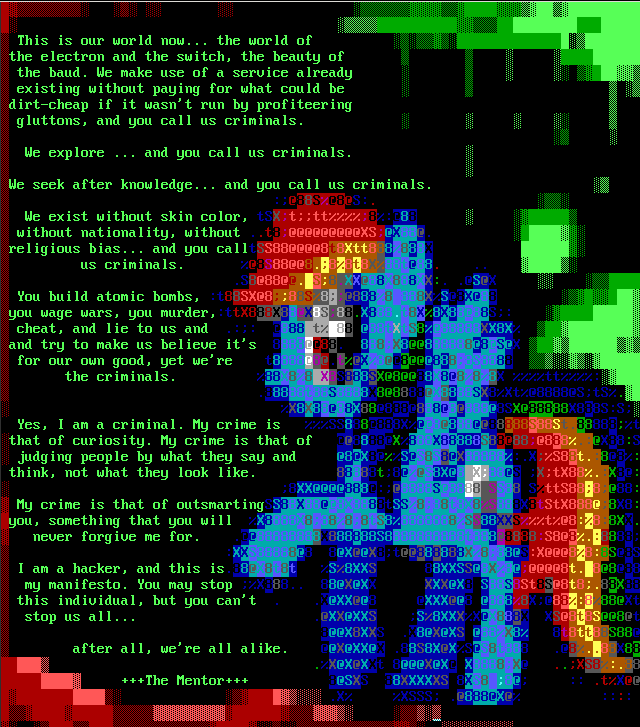

===============
Crypter writeup
===============

.. note::

    If you haven't done the challenge yet I urge you to give it a try first.

    You can find it here_.

.. _here: ../file/crypter.tgz

So here is the crypter writeup. What is it about?

::

    A file was encrypted.
    You have the encryption software and an encrypted file.
    Decrypt that file.

Challenge accepted!

Identification
==============

Let's first identify what we have:

.. code:: bash

    $ file crypter
    crypter: ELF 32-bit LSB executable, Intel 80386, version 1 (SYSV),
    dynamically linked, interpreter /lib/ld-linux.so.2, for GNU/Linux 2.6.32,
    BuildID[sha1]=75c7244d2ffea7d3ef05604bb829bb5a8976ba1d, not stripped

    $ file out.crypt
    out.crypt: data

So, an executable and an unknown binary file. Given its name (and the README)
it sounds like it's encrypted. What's its entropy?

.. code:: bash

    $ ent out.crypt
    Entropy = 7.998705 bits per byte.

    Optimum compression would reduce the size
    of this 145032 byte file by 0 percent.

    Chi square distribution for 145032 samples is 259.60, and randomly
    would exceed this value 40.83 percent of the times.

    Arithmetic mean value of data bytes is 127.2753 (127.5 = random).
    Monte Carlo value for Pi is 3.151249379 (error 0.31 percent).
    Serial correlation coefficient is -0.004602 (totally uncorrelated = 0.0).

Almost 8 bits by byte... Ok, so the entropy is very high and that also means
that it's likely to be really encrypted. A low entropy means lots of
structure in the file which is exactly what cryptography tries to remove.

.. raw:: pdf

    PageBreak

Maybe there is some information in the file itself? Some kind of header?

.. code:: bash

    $ xxd out.crypt | head
    0000000: 7d66 4fc6 acdb 7b27 ef50 9d4f c2a7 dac0  }fO...{'.P.O....
    0000010: 27a4 11f7 d5bb 29ea 465f 4c10 157f a16f  '.....).F_L....o
    0000020: 1887 8be4 58a5 b506 68f7 8b2b bff9 d438  ....X...h..+...8
    0000030: 9bda 3869 1f56 23b3 d54b 9ef9 9c3d 52b7  ..8i.V#..K...=R.
    0000040: 5bd8 86f3 b7de 96e6 d9e4 bf44 5b3b b20b  [..........D[;..
    0000050: e571 7f8f 8516 9ed2 a3d1 80a3 9762 941f  .q...........b..
    0000060: 8554 5268 6319 8953 0652 6787 f756 cb3c  .TRhc..S.Rg..V.<
    0000070: 2faa da61 704a d60d 03aa 806a f881 6d5e  /..apJ.....j..m^
    0000080: 81be a5e3 6678 abac 1b8c c08a fc33 bb97  ....fx.......3..
    0000090: 1c7b e3cd e188 4525 5113 e0b2 fda0 156d  .{....E%Q......m

Nope. Doesn't look like it. We'll have to reverse the binary.

Reversing
=========

We'll use radare2 to perform the reversing.

.. code:: bash

    $ r2 crypter
    -- Everytime you run radare2, a random file is removed :)
    [0x08048510]> s main
    [0x0804860b]> af
    [0x0804860b]> pdf
    ...

Well, that's a long main. For the sake of readability I'll focus on specific
parts. What functions are called in this main function?

.. code:: bash

    [0x0804860b]> pdf~call
    |           0x08048621      e86afeffff     call sym.imp.time
    |           0x0804862d      e86efeffff     call sym.imp.srand
    |           0x0804863d      e86efeffff     call sym.imp.unlink
    |           0x08048652      e869feffff     call sym.imp.fopen
    |           0x0804866a      e851feffff     call sym.imp.fopen
    |      .--> 0x08048677      e854feffff     call sym.imp.rand
    |      ||   0x08048692      e849feffff     call sym.imp.fwrite
    |      |    0x080486a5      e846feffff     call sym.imp.fread
    |           0x080486b7      e844feffff     call sym.imp.fclose

.. raw:: pdf

    PageBreak

The first thing we see is that all functions called are dynamically linked.
This means that all the effective code of the process is in the main. We'll
walk through it one section at a time.

.. code:: bash

    / (fcn) sym.main 207
    |   sym.main ();
    |           ; var int local_11h @ ebp-0x11
    |           ; var int local_10h @ ebp-0x10
    |           ; var int local_ch @ ebp-0xc
    |           ; var int local_4h @ ebp-0x4
    |           ; var int local_4h_2 @ esp+0x4
    |           0x0804860b      8d4c2404       lea ecx, [esp + local_4h_2]
    |           0x0804860f      83e4f0         and esp, 0xfffffff0
    |           0x08048612      ff71fc         push dword [ecx - 4]
    |           0x08048615      55             push ebp
    |           0x08048616      89e5           mov ebp, esp
    |           0x08048618      51             push ecx
    |           0x08048619      83ec14         sub esp, 0x14

Function prologue. Radare2 tells us that he identifies 5 local variables. We
allocate 0x14 bytes of memory on the stack for those variables. 0x14/4=5 so
it is coherent with what radare says if all variables are considered to be of
size 4 which is what it identifies given the offsets it gives.

.. code:: bash

    |           0x0804861c      83ec0c         sub esp, 0xc
    |           0x0804861f      6a00           push 0
    |           0x08048621      e86afeffff     call sym.imp.time
    |           0x08048626      83c410         add esp, 0x10

Standard call to an external function for an x86 binary. We first allocate
the stack frame of the function, push the argument (0) and end up
deallocating it. This call is really:

.. code:: c

    time(0);

The next call is similar:

.. code:: bash

    |           0x08048629      83ec0c         sub esp, 0xc
    |           0x0804862c      50             push eax
    |           0x0804862d      e86efeffff     call sym.imp.srand
    |           0x08048632      83c410         add esp, 0x10

We pass eax, the return value of the call to time, to srand.
So our code is really:

.. code:: c

    srand(time(0));

This initializes the global random number generator with the current time.

.. code:: bash

    |           0x08048635      83ec0c         sub esp, 0xc
    |           0x08048638      6860870408     push str.out.crypt
    |           0x0804863d      e86efeffff     call sym.imp.unlink
    |           0x08048642      83c410         add esp, 0x10

.. raw:: pdf

    PageBreak

Here we call unlink with the argument "out.crypt". Unlink is used to delete a
file.

.. code:: c

    srand(time(0));
    unlink("out.crypt");

.. code:: bash

    |           0x08048645      83ec08         sub esp, 8
    |           0x08048648      686a870408     push str.wr_______________
    ; str.wr_______________ ; "wrsource.png" @ 0x804876a
    |           0x0804864d      6860870408     push str.out.crypt
    ; str.out.crypt ; "out.crypt" @ 0x8048760
    |           0x08048652      e869feffff     call sym.imp.fopen
    |           0x08048657      83c410         add esp, 0x10
    |           0x0804865a      8945f4         mov dword [ebp - local_ch], eax

We open a file with fopen. Its arguments are a filename (here out.crypt) and
the permissions in the form of a string. This argument seems fishy:
wrsource.png doesn't sound like a valid permission qualifier... Let's check:

.. code:: bash

    [0x08048645]> px 5 @ str.wr_______________ 
    - offset -   0 1  2 3  4 5  6 7  8 9  A B  C D  E F  0123456789ABCDEF
     0x0804876a  7700 7200 73                             w.r.s

Ok, so as C strings are null-terminated the string really is "w\0". Radare
must have thought that it was a wide string where all characters are encoded
on two bytes.

fopen returns a pointer to a file which is stored in the local variable
local_ch.

.. code:: c

    srand(time(0));
    unlink("out.crypt");
    FILE* local_ch = fopen("out.crypt", "w");

.. code:: bash

    |           0x0804865d      83ec08         sub esp, 8
    |           0x08048660      686c870408     push 0x804876c; "rsource.png"
    |           0x08048665      686e870408     push 0x804876e; "source.png"
    |           0x0804866a      e851feffff     call sym.imp.fopen
    |           0x0804866f      83c410         add esp, 0x10
    |           0x08048672      8945f0         mov dword [ebp - local_10h], eax

Another similar call to fopen. Radare2 is still fooled by the strings but we
won't be! It's clear that we open source.png in read mode and store the
handle in local_10h.

.. code:: c

    srand(time(0));
    unlink("out.crypt");
    FILE* local_ch  = fopen("out.crypt",  "w");
    FILE* local_10h = fopen("source.png", "r");

Let's stop there for a second because we just discovered something very
important: the source is a PNG file! This means that our cryptographic
analysis just turned (partially) into a know-text attack as the structure
presents some static parts like a MAGIC number. We'll come back to that
later.

.. raw:: pdf

    PageBreak

.. code:: bash

    |       ,=< 0x08048675      eb23           jmp 0x804869a
    |      .--> 0x08048677      e854feffff     call sym.imp.rand
    |      ||   0x0804867c      89c2           mov edx, eax
    |      ||   0x0804867e      0fb645ef       movzx eax, byte [ebp - local_11h]
    |      ||   0x08048682      31d0           xor eax, edx
    |      ||   0x08048684      8845ef         mov byte [ebp - local_11h], al
    |      ||   0x08048687      ff75f4         push dword [ebp - local_ch]
    |      ||   0x0804868a      6a01           push 1
    |      ||   0x0804868c      6a01           push 1
    |      ||   0x0804868e      8d45ef         lea eax, [ebp - local_11h]
    |      ||   0x08048691      50             push eax
    |      ||   0x08048692      e849feffff     call sym.imp.fwrite
    |      ||   0x08048697      83c410         add esp, 0x10
    |      |`-> 0x0804869a      ff75f0         push dword [ebp - local_10h]
    |      |    0x0804869d      6a01           push 1
    |      |    0x0804869f      6a01           push 1
    |      |    0x080486a1      8d45ef         lea eax, [ebp - local_11h]
    |      |    0x080486a4      50             push eax
    |      |    0x080486a5      e846feffff     call sym.imp.fread
    |      |    0x080486aa      83c410         add esp, 0x10
    |      |    0x080486ad      85c0           test eax, eax
    |      `==< 0x080486af      75c6           jne 0x8048677

This snippet is longer because it really is a loop. We can see that with the
two intricated jumps. The loop condition is tested at 0x080486ad: `test eax,
eax` which reads as “The last function call returned 0”. In that case we exit
the loop, otherwise we go back to the beginning.

The first iteration skips most of the loop to start with a call to fread.
That call takes the following arguments:

::

    void*  ptr    = eax; (loaded with the address of local_11h, a buffer)
    size_t size   = 1;
    size_t nmemb  = 1;
    FILE*  stream = local_10h; ("source.png")

So we read source.png one byte at a time into local_11h until there's nothing
to read anymore.

.. code:: c

    srand(time(0));
    unlink("out.crypt");
    FILE* local_ch  = fopen("out.crypt",  "w");
    FILE* local_10h = fopen("source.png", "r");

    char local_11h;
    while (fread(&local_11h, 1, 1, local_10h)) {
        // ...
    }

What do we do in that loop? We call rand, move its result in a register (1
byte), xor that byte with our local_11h byte-long buffer. We then push that
on the stack along with fwrite arguments:

::

    void*  ptr    = local_11h; (now xored with rand())
    size_t size   = 1;
    size_t nmemb  = 1;
    FILE*  stream = local_ch; ("out.crypt")

We write that byte into out.crypt.

This is a simple stream cipher based on rand xored with the plaintext, and we
now have understood the more important part of the program:

.. code:: c

    srand(time(0));
    unlink("out.crypt");
    FILE* local_ch  = fopen("out.crypt",  "w");
    FILE* local_10h = fopen("source.png", "r");

    char local_11h;
    while (fread(&local_11h, 1, 1, local_10h)) {
        local_11h ^= (char) rand();
        fwrite(&local_11h, 1, 1, local_ch);
    }

The end is quite clear:

.. code:: bash

    |           0x080486b1      83ec0c         sub esp, 0xc
    |           0x080486b4      ff75f0         push dword [ebp - local_10h]
    |           0x080486b7      e844feffff     call sym.imp.fclose
    |           0x080486bc      83c410         add esp, 0x10
    |           0x080486bf      83ec0c         sub esp, 0xc
    |           0x080486c2      ff75f4         push dword [ebp - local_ch]
    |           0x080486c5      e836feffff     call sym.imp.fclose
    |           0x080486ca      83c410         add esp, 0x10
    |           0x080486cd      b800000000     mov eax, 0
    |           0x080486d2      8b4dfc         mov ecx, dword [ebp - local_4h]
    |           0x080486d5      c9             leave
    |           0x080486d6      8d61fc         lea esp, [ecx - 4]
    \           0x080486d9      c3             ret

We close local_10h and local_ch and exit the program returning eax so 0.

.. code:: c

    srand(time(0));
    unlink("out.crypt");
    FILE* local_ch  = fopen("out.crypt",  "w");
    FILE* local_10h = fopen("source.png", "r");

    char local_11h;
    while (fread(&local_11h, 1, 1, local_10h)) {
        local_11h ^= (char) rand();
        fwrite(&local_11h, 1, 1, local_ch);
    }

    fclose(local_ch);
    fclose(local_10h);
    return 0;

Yeah! We now have the whole source code of the crypter (or a good enough
approximation).

.. raw:: pdf

    PageBreak

Cryptanalysis
=============

We may have discovered the algorithm we still can't decrypt our file, can we?

The algorithm goes like this:

::

                             +-----------------+
                             |  Current Time   |
                             +-----------------+
                                      |
                                      V
                             +-----------------+
                             |     Rand()      |
                             +-----------------+
                                      |
                                      |
                                     _V_
    +---------------+               /   \            +------------+
    |   Plaintext   |--------------> XOR ----------->| Ciphertext |
    +---------------+               \___/            +------------+

As we can see the only secret is the initial time used to seed the system. If
we are able to find this time we also are able to predict any further output
so we must find this seed.

Wait a second... That call to time() wasn't long before the fwrite() one.
This means that the time used to seed and the time used to build the malware
must be close to each other.

.. code:: bash

    $ ls -l out.crypt
    -rw-r--r-- 1 cym13 cym13 145032 Oct 20 11:31 out.crypt
    $ date -d "Oct 20 11:31" "+%s"
    1476955860

Here we have our time! Well, it's quite approximative, but it's ok for as.
Why so? Because it is not a blackbox analysis, remember, it's a
known-plaintext analysis! As we know that we are looking for a PNG file we
can easily know when we have the right seed: it will simply be the one that
gives us a valid PNG file.

How do we know that a file is a PNG file? We check its magic number!
Wikipedia_ gives us the following number:

.. _Wikipedia: https://en.wikipedia.org/wiki/Portable_Network_Graphics

::

    89 50 4e 47 0d 0a 1a 0a
       P  N  G  \r \n    \n

So the strategy is the following:

1. Starting from the creation time we seed the random number generator
2. We decrypt the first bytes
3. We check that it starts with the magic number
4. If it failed we haven't found the right seed, checking the next one
5. Once we have the right seed we just have to decrypt the whole file!

Let's get to it!

Exploitation
============

The following is the code of the solver as described previously. The
decryption code is almost a copy-paste of the encryption one because xor
nullifies itself.

.. code:: c

    #include <time.h>
    #include <stdio.h>
    #include <string.h>
    #include <stdlib.h>
    #include <unistd.h>

    #define start_seed 1476955850 // A bit under the actual time found
    #define end_seed   1476960000 // We need some kind of limit, >1h seems good

    void decrypt(unsigned seed) {
        srand(seed);
        FILE* fi = fopen("out.crypt", "r");
        FILE* fo = fopen("out.png",   "w");

        char buf;
        while (fread(&buf, 1, 1, fi)) {
            buf ^= (char) rand();
            fwrite(&buf, 1, 1, fo);
        }

        fclose(fo);
        fclose(fi);
    }

    int try_decrypt(unsigned seed) {
        char magic[]  = "\x89\x50\x4e\x47\x0d\x0a\x1a\x0a";
        char buffer[8];

        FILE* fi = fopen("out.crypt", "r");
        fread(buffer, 8, 1, fi);
        fclose(fi);

        srand(seed);

        for (int i=0; i<8; i++) {
            buffer[i] ^= (char)rand();
        }

        return memcmp(buffer, magic, 8);
    }

    int main(int argc, char *argv[]) {
        unsigned seed;
        for (seed=start_seed; seed<end_seed; seed++) {
            if (try_decrypt(seed) == 0)
                break;
        }
        printf("Seed found! %u\n", seed);
        decrypt(seed);
        return 0;
    }

Don't forget to compile this code in 32bits mode:

.. code:: bash

    $ gcc -m32 solver.c -o solver
    $ ./solver
    Seed found! 1476955866

And here is our image:

