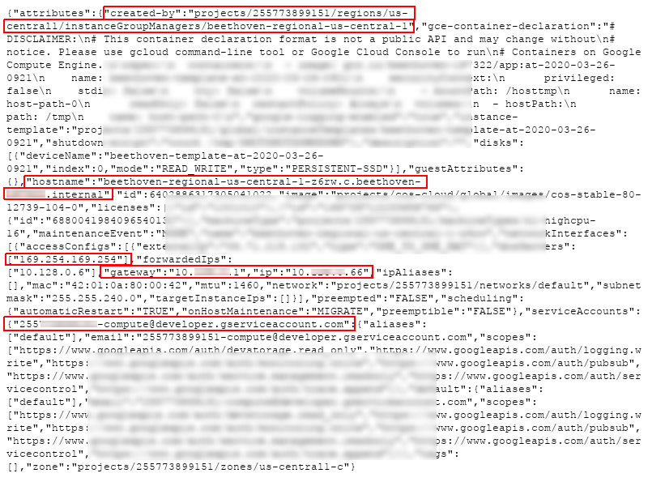

==============================================
Dusty File: Padlet Server-Side Request Forgery
==============================================

*This article is part of the Dusty Files series. It does not tackle a current
security issue but an old case that is old enough to become publicly
available.*

Introduction
============

I was browsing my bugbounty and other research related files recently and
noticed several of them that I think should be made public and may be of
interest to some readers. This is the purpose of that series: the Dusty
Files. I'm not sure yet how many I'll include but hopefully it'll prove
fun, and to kick it off I'd like to come back two years ago during the
Covid-19 pandemic.

France, like many countries, was in full lockdown. The situation wasn't ideal
for many professions that aren't normally performed remotely, like teaching
in an elementary school. A teacher I know was explaining the new software
they were testing to organize communications with their classroom: Padlet.

`Padlet.com <https://padlet.com>`_ allows its users to create multimedia
dashboards with a sticker note mindset and to open these dashboards to
collaboration. I decided to have a look as I was sure the website would grow
in popularity over the pandemic. This allowed me to find a nice Server-Side
Request Forgery which is thankfully fixed.

The vulnerability
=================

While reviewing padlet.com I noticed that a preview image is generated for
any resource posted on the website through this url:

    https://padlet.com/static/v1/api/links?url=http://example.com

Following the trail of that feature I identified that the API that fetches
the URL and generates a preview is at the following URL:

    https://media.padletcdn.com/15/render/cropped_0,format_png/http%3A%2F%2example.com

Such feature is interesting because the website fetches content based on a
user-provided URL. This is the basis of a Server-Side Request Forgery (SSRF).

A Server-Side Request Forgery (SSRF) vulnerability happens when an attacker
is able to get a server to perform web requests on his behalf. This can be
exploited in a variety of ways, from discovering internal addresses and
services to exfiltrating information as we will see.

Now, in our case there are some limitations in place, in particular it is not
possible to pass an IP address to that API, only a domain name. No problem:
we'll just use a domain that resolves to the internal IP address we're
interseted in. To do that we can use services such as nip.io that generate a
dynamic DNS name for any ip address. That way we can fetch localhost:

    https://media.padletcdn.com/15/render/cropped_0,format_png/http%3A%2F%2F127.0.0.1.nip.io

.. figure:: ../image/padlet_localhost.png
    :width: 40%

    Main page of localhost generated by the service

Yes, that's the 9th Symphony from Beethoven. Why? Why not?

Anyway, by making the server contact a server that I own I identified its
external IP address (37.71.215.132). This address range is related to
Google's cloud platform. This cloud has a metadata service at a fixed domain
name which is only available internally (metadata.google.internal). I
therefore asked this service for the server's configuration.

Normally a special header is necessary to access this server in order to
block this attack. However that's only for the v1 API, the v1beta1 API on the
other hand happily responds with our information:

`https://media.padletcdn.com/15/render/cropped_0,format_png/
http%3A%2F%2Fmetadata.google.internal%2FcomputeMetadata%2Fv1beta1%2Finstance?alt=json&recursive=true
<https://media.padletcdn.com/15/render/cropped_0,format_png/http%3A%2F%2Fmetadata.google.internal%2FcomputeMetadata%2Fv1beta1%2Finstance?alt=json&recursive=true>`_

    Cloud configuration

Knowing the internal IP range it was then possible to start scanning it to
find other hosts, always using our SSRF and nip.io.

.. code:: bash

    # Note: fake internal IP address
    base_url="https://media.padletcdn.com/15/render/cropped_0,format_png/"
    wget "$base_url"/http%3A%2F%2F10.0.0.${1..255}.nip.io

I found 30 seperate hosts that way on the same range as that server. Of
course the exact number is of little significance as the cloud probably
dynamically starts and stops new instances all the time.

All theses hosts presented the same Beethoven piece as localhost so I believe
them to be copies of the same instance.

Remediation
===========

Server-Side Request Forgery remediation requires validation of user inputs.
However that is hard to do well, so the main recommendation in such case is
to resolve the domain name down to an IPv6 address and only then check that
this address is not internal before retrieving any content.

Furthermore retrieving the content should ideally be done using the already
resolved IP address. Otherwise it would still be possible to attack the
vulnerability through DNS rebinding:

- The attacker asks for http://malicio.us which is a domain he controls that
  has a very short TTL to ensure that it is not cached and must be resolved
  every time.
- media.padletcdn.com resolves that domain. It points to an external IP
  address.
- The attacker changes malicio.us IP address to 127.0.0.1 (for example)
- media.padletcdn.com retrieves the content to make a preview image. Due to
  the short TTL it is forced to resolve the domain again and that resolves to
  127.0.0.1 which is internal.
- The attacker gets a preview of the internal IP address.

To avoid that I recommended Padlet to ensure that media.padletcdn.com uses a
local DNS which has a minimum TTL of at least 1 minute. That way the domain
will never be resolved twice for the same request. Did they do it? I don't
know. I quickly checked the URLs shown above and the issue seems fixed,
that's all I know.

Timeline
========

- SSRF found on 2020-03-28
- SSRF reported on 2020-03-28
- SSRF fixed during the following month

Conclusion
==========

Whenever the web application is the one doing a web request there is a
potential for SSRF and this was a cool example of how such SSRF can be
exploited in the special case of Google's cloud. I hope it was entertaining!

----

Image sources
-------------

- https://www.deviantart.com/davidsfire/art/Octavia-Rocking-out-vector-561038579
