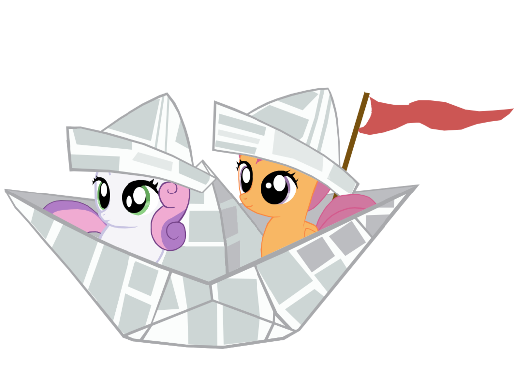

=====================
Docker for pentesters
=====================

Setting the course
==================

Docker? That light VM thing for developers?
-------------------------------------------

If you're in the industry you've certainly heard the name "Docker" by now.
It is often presented as a light VM used by developers to automate
deployment and many_ articles_ were_ written_ along that line.

.. _many: https://blog.docker.com/2016/05/docker-101-getting-to-know-docker/
.. _articles: https://www.infoworld.com/article/3077875/linux/containers-101-docker-fundamentals.html
.. _were: https://www.networkworld.com/article/2361465/cloud-computing/docker-101-what-it-is-and-why-it-s-important.html
.. _written: https://auth0.com/blog/docker-101-for-developers/

I'd like to try to present another angle of Docker. I won't delve into its
internals, explain how it works or how it can make development and
deployment easier. Instead I'd like to show how security professionals can
use it in their daily assessments.

Ok, but for pentesters, really?
-------------------------------

There are many cases where security professionals need to see an application
running. For example it can help eliminate false positives while performing a
code review. Having the server running on your own computer also means you
are able to track down network streams at will, see what files change in what
ways when you perform such and such actions and all this without risking
putting the production down.

I use Docker whenever possible when I have a code review to do because while
I love reading the code there are many assumptions that are more quickly
grasped when seeing it running at least once in its expected configuration.

I also use it when pentesting on a customer's network if I find an
open-source application I don't know well. That allows me to quickly see what
the default configuration may be, what components it relies on, what the
default password is if there's one etc. It also means I'm able to try finding
a new vulnerability in that version first before trying it out on the real
server.

It can also be useful to quickly try new tools such as web scanners without
having to configure them in any way. In 5 minutes the container is up and
running and you can start poking at your target.

So what is Docker?
------------------

A Docker container is not a VM. It's a way to run a process just like any
other on your computer, while lying to it to make it think it's on a whole
different environment. This means it's very light as you're just running
normal processes and not a completely different system with its own emulated
hardware or separate kernel.

This last point also hints at a very important limitation of Docker
containers: the kernel is shared between the host and all containers. Any
kernel exploit would result in a major privilege escalation.

Furthermore Docker containers can be made public through a common
repositories. Well, to be exact the container itself isn't shared, instead a
Dockerfile is which is a configuration file used to setup and run a
container. This is all very similar to AUR in the Archlinux world and will be
transparent to us.

Setting up the container
========================

Installation
------------

Just install it from your favorite package manager and ensure the daemon is
running. There's nothing to setup. You may want to add yourself to the
**docker** group to use it as a regular user though.

Finding a new image
-------------------

In this example we'll setup an OpenVAS container.

Let's first search the main repository for OpenVAS containers:

::

    $ docker search openvas
    NAME                              DESCRIPTION
    STARS               OFFICIAL            AUTOMATED
    mikesplain/openvas                A docker container for OpenVAS
    77                                      [OK]
    combro2k/openvas
    3                                       [OK]
    ictu/openvas-docker               OpenVAS scanscript in Docker container
    2                                       [OK]
    sergekatzmann/openvas8-complete   Docker container for OpenVAS8
    1                                       [OK]
    [...]

We see many people have been publishing OpenVAS containers. They are sorted
by popularity which is measured in stars. We don't have any special
requirement so let's just take the first one.

::

    $ docker run mikesplain/openvas

As we've never ran that image before it will download it, configure it and
start it. This can take a few minutes. OpenVAS kindly tells us at some point
that "your OpenVAS-9 installation is OK" so we must be finished.

Getting infos
-------------

Let's check our running container out:

::

    $ docker ps
    CONTAINER ID        IMAGE                COMMAND               CREATED
    STATUS              PORTS               NAMES

    63c489feb707        mikesplain/openvas   "/bin/sh -c /start"   8 minutes
    ago       Up 7 minutes        443/tcp, 9390/tcp   elegant_lovelace

The name "elegant_lovelace" may be different for you as it is randomly
generated. It is just an easier way to refer to the container ID. We also see
the application bound the ports 443 and 9390. But what is its IP address?

The "inspect" command is used to gather all sorts of details on our
containers.

::

    $ docker inspect elegant_lovelace | grep IPAddress
            "SecondaryIPAddresses": null,
            "IPAddress": "172.17.0.2",
                    "IPAddress": "172.17.0.2",

Getting access
--------------

Ok, let's connect to our application on https://172.17.0.2/. We're asked for
a password but admin/admin isn't that hard to guess. And that's it, we've got
it running!

We're not limited to a web interface though, we can also get a shell if
needed:

::

    $ docker exec -t -i elegant_lovelace /bin/bash
    root@63c489feb707:/#

As **man docker-exec** kindly tells us the option **-t** is used to get a TTY
and **-i** to run the command interactively.

Here we encountered the most common case where the container starts a server
that keeps it from shutting down. Sometimes it isn't that easy and the
container expects you to open an interactive shell from the start instead in
order to configure and run the application. That can be done in our example
with:

::

    $ docker run mikesplain/openvas -t -i /bin/bash

Cleanup
-------

Ok, we've played with OpenVAS enough, found a few flaws or whatever, the
thing is we're done with it and want it gone. Let's stop it first. We'll then
remove the container and the original image to leave a clean system behind
us:

::

    $ docker stop elegant_lovelace
    $ docker rm elegant_lovelace
    $ docker rmi mikesplain/openvas

And that's it, we're done here.

Sailing away
============

.. image:: ../image/mane_six_boat.png
    :width: 60%

As we saw, using Docker to quickly install, setup, use and remove a whole
application is very easy. Here are all the commands we used:

::

    docker search <application>
    docker run <image name>
    docker ps
    docker inspect <container name>
    docker exec -ti <container name> /bin/bash
    docker stop <container name>
    docker rm <container name>
    docker rm <image name>

That's all there is to know from a pentester's point of view. There's much
more to Docker than that though as we didn't talk about creating our own
images or actually configuring anything: it really is a powerful tool. But
all these are beyond the ambitions of our article which I hope was of some
help to you.

Happy sailing!

Image sources
-------------

- https://dmn666.deviantart.com/art/We-Were-Sailing-Along-295674765
- https://jeatz-axl.deviantart.com/art/Mane-Six-On-A-Boat-675692297
