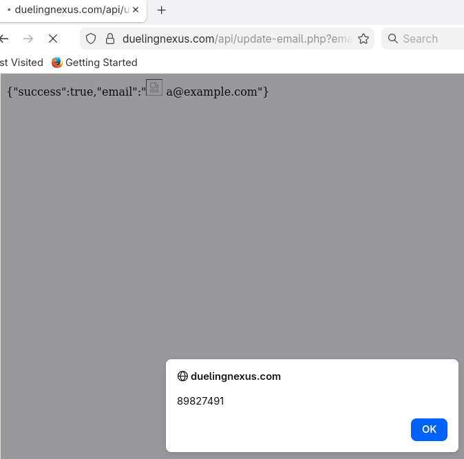
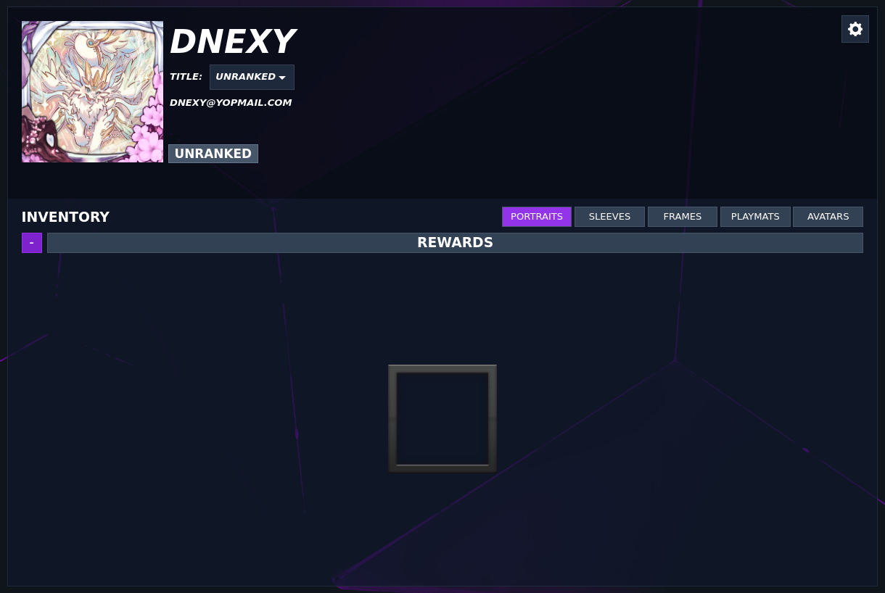

================================
Vulnerabilities in Dueling Nexus
================================

Introduction
============

Yu-Gi-Oh is a fun competitive card game (go Dragonmaids!). If you want to
play online, the main game is Master Duel, an official platform by Konami
which is frankly great. However, it only supports the Advanced format and
uses a banlist which is different from the game on paper. If you want to play
other formats (such as Genesys) or prepare for paper tournaments online, you
need to turn to other clients.

One such client is `Dueling Nexus <https://duelingnexus.com>`_, a web-based
free unofficial client which is great to play with friends or on a ladder.
You can unlock cosmetics by playing and winning credits that can then be
spent on special cosmetics. There is a donation service, but the game itself
is completely free.

As you know however, I cannot browse a new website without being curious
about how it works exactly, and Dueling Nexus was no exception. Late
September 2025, this lead to the discovery of several vulnerabilities on the
website. I disclosed them to the developers, but as much as I like their
commitment to building a great free playing space, their response left a lot
to be desired. Reaching them was very difficult, I received no response
whatsoever and as far as I can tell nothing has been fixed 3 months later. At
this point it seems more important to put that information out there so the
users may know what to expect rather than wait indefinitely.

Of course, we need to adjust our expectations: this is not a banking website,
it's a free trading card game. Most users would have neither high
expectations of security, nor many secrets to protect. But there are some
issues that are important regardless, and hardcore players are probably
attached to their account.

What it means to players
------------------------

There are issues, but nothing that would prevent me from playing on Dueling
Nexus. However it's important to be cautious:

- Backup your decks so you don't lose them if someone takes over your account.

- Don't use shared computers, or clear the cookies before using it.

- Phishing is a main risk, so don't blindly click links to Dueling Nexus. If
  the URL looks unusual, don't click it. If you do click a malicious link,
  the attacker can do more than attack your Dueling Nexus account, they can
  also attack your computer and other computers on your network.

- You can technically get any cosmetics you want for free, but please refrain
  from doing so. It's a free game with a passionate community, let's not
  break that mutual trust that when you see someone with a badass frame they
  worked to obtain it.

- Do not put any secret on Dueling Nexus and in particular use a unique
  password specifically for that website that isn't shared with any other.
  Currently, the team at Dueling Nexus seems unbothered by the issues that we
  present here, which is not a posture that warrants confidence in the way
  they manage security on other topics. While I trust them to build a great
  game, I would not trust them with any secret.

With that said, Dueling Nexus:

- `V1: Session Fixation <#v1-session-fixation-1>`_
- `V2: Cross-Site Request Forgery <#v2-cross-site-request-forgery-1>`_
- `V3: Cross-Site Scripting <#v3-cross-site-scripting-1>`_
- `V4: Insecure Direct Object Reference <#v4-insecure-direct-object-reference-1>`_

V1: Session Fixation
====================

`CVSSv4 Score: 4.6 / Medium severity
<https://www.first.org/cvss/calculator/4-0#CVSS:4.0/AV:L/AC:L/AT:N/PR:N/UI:A/VC:L/VI:L/VA:N/SC:N/SI:N/SA:N>`_

Description
-----------

When first loading the website, a session token is provided by the website
and stored in a cookie (PHPSESSID). The role of the cookie is to establish a
session: this token will be sent with each request so the server knows that
they all come from the same user.

Normally, a new session token is provided upon login, but this is not the
case here. This is a vulnerability called session fixation. Since this token
is what authenticates the request, it carries the weight of a password once
the user is logged in and must be protected against disclosure.

Here the attack is as follows :

* Let's assume that multiple people are using the same computer (ex: in a
  school)

* Eve, the attacker, opens a https://duelingnexus.com in Firefox (any browser
  would do). At that point a session cookie is provided for her, but she
  doesn't log in.

* Eve looks in the browser's memory (F12 -> Application -> Cookies) and notes
  the content of the PHPSESSID cookie.

* Eve leaves the computer, leaving Firefox open.

* Alice comes in and decides to connect to https://duelingnexus.com to play a
  game. She logs in.

* At that point, the website should provide her with a fresh session token,
  but it doesn't. Instead it keeps using the one it already has, which is
  known to Eve.

* Eve has the session token, and she can now put it in her own browser's
  memory : when she loads https://duelingnexus.com she is now logged in as
  Alice.

This attack is technically simple, but requires to be physically present.
The impact is as high as it can be for Dueling Nexus and is easily fixed.

Remediation
-----------

It is important to generate a new PHP session, and therefore issue a new
session token, the moment the user logs in.

The cookie PHPSESSID should also make use of security flags to protect its
value : HttpOnly, Secure and SameSite=strict. These flags are protections
against stealing cookies with XSS, sending cookies over HTTPS and Cross-Site
Request Forgeries (see `Vulnerability 2 <#v2-cross-site-request-forgery-1>`_).

V2: Cross-Site Request Forgery
==============================

`CVSSv4 Score: 6.9 / Medium severity
<https://www.first.org/cvss/calculator/4-0#CVSS:4.0/AV:N/AC:L/AT:N/PR:N/UI:A/VC:N/VI:H/VA:N/SC:N/SI:N/SA:N>`_

Description
-----------

A Cross-Site Request Forgery (CSRF) exploits the fact that cookies are sent
automatically upon any request to the domain they're tied with, even if the
request isn't made from the same website.

In practice the attack would go as follows :

* Eve prepares a website (something juicy, like some ygo scandal at a YCS).
  In the website, she puts a special bit of JavaScript that makes a request
  to https://duelingnexus.com that changes the current account's email to
  eve@malicious.net.

* Eve sends her website's address on the discord

* Alice is connected on Dueling Nexus when she sees Eve's message. Intrigued,
  she clicks on the link.

* Alice loads Eve's website, and the associated JavaScript. A request is made
  to change the current account's email (so Alice's in this case) to one
  owned by Eve. It works because, since Alice is connected, that change
  request is made with Alice's credentials (session cookie).

* Alice sees that she's back on Dueling Network's profile page, but doesn't
  understand what happened.

* In parallel, Eve makes a password recovery request for eve@malicious.net,
  gets the code, and changes the password. Eve now has full control over
  Alice's account.

Here is an example of the page Eve could use in this scenario : when visited
it performs a mail change to "eve@malicious.net".

.. code:: html

    <!DOCTYPE html>
    <html>
      <head>
        <meta charset="UTF-8" />
        <title>Vulnerability 2 : CSRF</title>
      </head>

      <body>
        <form id="changemail" method="POST" action="https://duelingnexus.com/api/update-email.php">
          <input type="text" name="email" value="eve@malicious.net"/>
        </form>
        
      </body>
    </html>

This attack involves an explicit action from the victim (visiting Eve's
website) but people visit new web pages all the time so it is a reasonable
threat. The impact is as high as it can for Dueling Nexus.

Note: some but not all web browsers may block this attack by default.

Remediation
-----------

There are mechanisms to prevent this. The main idea is to make sure that the
request to change something on the server side, comes from the website itself
and not some random page visited on the net.

There are several ways to tackle the problem: SameSite is the easiest of the
two to setup as it is just a cookie flag.  Adding "SameSite=Strict" (or,
worse but ok, SameSite=Lax) to the PHPSESSID cookie would indicate to the
browser that it must not authenticate that password change request.

This method is simple to setup and is what I recommend in this case. There
are limitations, and alternatives, but from what I see this is the best
option here so I won't discuss them.

V3: Cross-Site Scripting
========================

`CVSSv4 Score: 5.1 / Medium severity
<https://www.first.org/cvss/calculator/4.0#CVSS:4.0/AV:N/AC:L/AT:N/PR:N/UI:A/VC:N/VI:N/VA:N/SC:L/SI:L/SA:N>`_

Description
-----------

Dueling Nexus' API (https://duelingnexus.com/api/...) always returns JSON data,
but with the content type "text/html".

To see it, you can open the developer tools of the browser (F12 generally),
Network tab to see what requests are made, then opening
https://duelingnexus.com/api/news.php for example. By doing that you see two
things: in the list of requests, the response to news.php will have a header
"Content-Type: text/html", and in the main browser's window you'll see that
the JSON data is formatted: links, images and bold text are present. This
indicates that the response, despite being in JSON and not HTML, was
interpreted as HTML. This is something an attacker can use.

If an attacker, can force a JSON response to contain malicious
HTML/javascript, then anyone loading that JSON response directly would see
that JavaScript executed, and some malicious action would happen in their
session. This execution of user-controlled JavaScript is a vulnerability
called Cross-Site Scripting (commonly known as XSS).

Here is a URL showcasing that vulnerability by displaying a harmless popup:

::

    https://duelingnexus.com/api/update-email.php?email=%3Cimg%20src%3Dx%20onerror%3Dalert(89827491);%20x%3Da%3E%20a@example.com

When clicking that link while logged in Dueling Nexus, our mail is changed
and we receive a JSON response that includes the new mail. Since that
response's Content-Type is not set to JSON but HTML, by including HTML code
in our email we are able to reach arbitrary JavaScript execution.

The same principle can be applied at other points, such as through deck
searches. That attack is a bit more involved, so here's a narrative
description:

* Eve, our attacker, creates an account and creates a deck with the a name
  containing JavaScript. For example:

.. code:: html

  

* Eve sets the deck to be public. The deck now comes up in deck searches.

* Eve now needs a way to get users to search that deck, without using the web
  interface, but instead using the API directly. To do that, she'll use a
  CSRF (see Vulnerability 2). She creates a page that, when visited, will
  perform the corresponding search. Here is the code she can use:

.. code:: html

    <!DOCTYPE html>
    <html>
      <head>
        <meta charset="UTF-8" />
        <title>Vulnerability 3 : XSS</title>
      </head>

      <body>
        <form id="doSearch" method="POST" action="https://duelingnexus.com/api/deck-search.php">
          <input type="text" name="name" value="1337"/>
          <input type="text" name="tag" value="-1"/>
          <input type="text" name="special" value="-1"/>
          <input type="text" name="sort" value="0"/>
        </form>
        
      </body>
    </html>

* Now Eve shares a link to the page above to potential victims, like Alice.

* Alice clicks on Eve's link, loading the malicious page that performs a deck
  search, and the resulting page executes JavaScript on
  https://duelingnexus.com/. In this case a popup appears (in some browser
  configuration, it may not appear, but the JavaScript is still executed).

* This JavaScript displaying a popup isn't harmful to Alice, but it could be
  more dangerous. Since it is executed in Alice's session, it can do
  anything on the website that Alice can do, including changing Alice's mail
  to allow Eve to take over her account by using the account recovery
  process.

While this specific attack uses a CSRF, it's worth noting that it wouldn't be
stopped by SameSite since the deck search is available to unauthenticated
users. Also, it's very possible that other XSS are present that don't require
the help of a CSRF, but this is the first exploit I identified.

XSS are a dangerous vulnerability and, in this case they are enabled by the
use of the wrong Content-Type on the API. An attacker using an XSS controls
your web browser. It can not only do anything within Dueling Nexus that you
can, but also use your web browser to attack your computer or other computers
on your network.

Remediation
-----------

The solution is simple: since the API returns JSON, it must use a content
type "application/json".

It would also be interesting to have the HttpOnly flag on the PHPSESSID
cookie, as that would make it unavailable through JavaScript. This means that
an XSS would not be able to steal the cookie. This doesn't make XSS less
dangerous, but it does make it harder for the attacker to remain in discreet
control of the account.

V4: Insecure Direct Object Reference
====================================

`CVSSv4 Score : 5.3 / Medium
<https://www.first.org/cvss/calculator/4-0#CVSS:4.0/AV:N/AC:L/AT:N/PR:L/UI:N/VC:N/VI:L/VA:N/SC:N/SI:N/SA:N>`_

Description
-----------

It is possible to use cosmetics that we haven't unlocked. That's because,
when we set a cosmetics, the API doesn't check that we have legitimate access
to it.

To set a portrait for example, a POST request is made to
https://duelingnexus.com/api/update-portrait.php with in body
"portrait=<portrait id>".

We can pass any portrait id, no verification is performed. So for example
passing "portrait=33" gives us a portrait that we do not have:

Such a vulnerability is called Insecure Direct Object Reference (IDOR). This
reflects the fact that we can directly interact with objects (portraits in
this case) without proper limitations in place.

The same is true of of sleeves, frames, playmats or avatars.

While this vulnerability's impact isn't really stealing anyone, the use of
cosmetics by people that haven't earned them cheapens the value they
represent for players that have put in the effort to earn them legitimately.

Remediation
-----------

When receiving a request to update a cosmetics, a check must be performed to
ensure that the user has legitimate access to that cosmetics.

Conclusion
==========

This was far from a full audit. I limited my tests at things that were easy
to see simply from navigating the website and didn't test anything that could
negatively impact other players or jeopardize the availability of the server.
I also didn't test duels with other players, or the security of WordPress, a
popular framework that can easily be misconfigured or include vulnerable
extensions.

Now, none of this is really critical. I wouldn't let these issues prevent me
from playing the game, but it does demand caution.

It is clear that security leaves to be desired and I would not expect
these findings to be the only vulnerabilities lurking on Dueling Nexus. This
is further emphasized by the cold reaction by the Dueling Nexus team that
made no effort to facilitate communication, provided no response and
especially no fix for these issues.

Timeline
========

- 2025-09-30: Report written.
- 2025-10-01: Vulnerabilities reported to Dueling Nexus. No response.
- 2026-02-11: Public disclosure.
