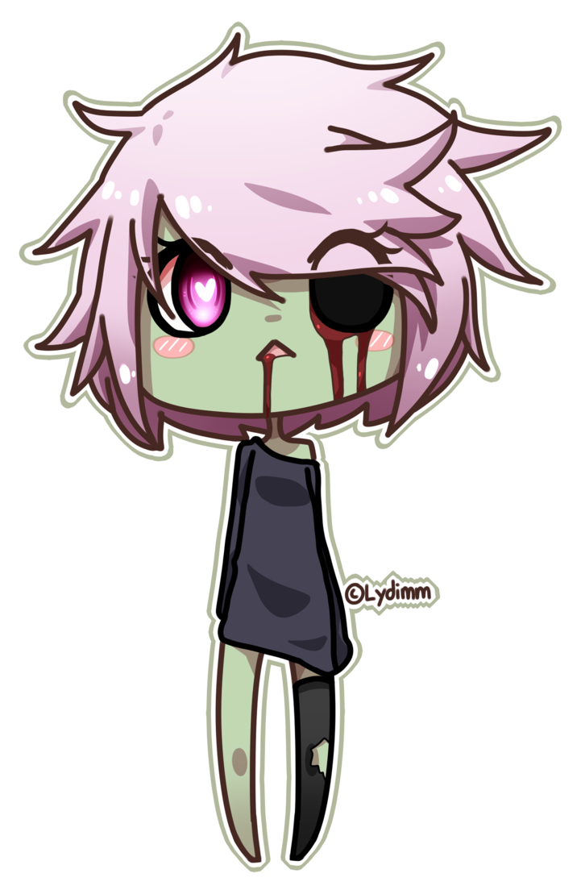

==================================================
Breaking dependencies with Github account takeover
==================================================

tl;dr
=====

- Github allows users to change names by forwarding requests to the new
  repository;
- Some package managers such as D's Dub or Go imports rely on Github
  repository URLs;
- We can take projects over by re-creating old repositories;
- Non-exhaustive list of impacted projects: Dub_ and Go_.

.. _Dub: ../file/github_takeover_dub_impacted_projects.txt

.. _Go: ../file/github_takeover_go_impacted_projects.txt

Getting started
===============

Everybody seems to be talking about Github these days so I'll follow the
trend. I don't want to talk about Microsoft though, so instead we'll explore
Github account takeover.

The name is misleading, we won't hack anybody's account. Instead we'll take
advantage of leftover redirections, digging old graves to reanimate dead
projects and see where that leads us.

So let's go digging!

.. image:: ../image/girl_shovel.png
    :width: 60%

Github redirections
===================

Github proposes a mechanism to help users change their usernames without
breaking other projects altogether: `redirections`_.

.. _redirections: https://help.github.com/articles/what-happens-when-i-change-my-username/

In summary Github maintains a redirection from your old account URL to your
new one. When someone else claims the username and creates a project with the
same name as the old one the redirection is disabled and the new project in
place takes the lead. People are expected to use that to have more time
changing their projects to the new URL.

Of course this assumption is flawed, nobody ever fixes what isn't broken and
since this is done transparently by Github other projects don't get any kind
of warning. After all, working transparently is the goal of this mechanism.

So, what kind of project would rely on Github URLs? Dependency systems.

Dub: D's package manager
========================

We'll first have a look at Dub since it is where I first noticed the issue.

Dub's backend, https://code.dlang.org, essentially works by registering a
repository through its Github URL (other providers are supported, but Github
is the one we're interested in).  It will then monitor the project for new
tags or branches and recover zip archives of these landmarks automatically.

A project is then able to specify Dub dependencies in its dub.json file.
While there are different way to specify a dependency's version, the most
common allows following all minor updates but not major ones.

The risk is quite clear: if the user changes its Github name after having
registered a project on Dub, then it is possible to create a new Github
account and project with the old name and get Dub to use our code instead of
the original one.

.. image:: ../image/zombie_girl_rabbit.png
    :width: 40%

Listing, listing...
-------------------

So, we'll start by enumerating all dead Github accounts that are still in
used. I'm certain there are better ways to do this, but a bit of bash is
easy enough to get the job done.

.. code:: sh

    dead() {
        curl -s "$1"           \
        | grep "blind github"  \
        | cut -d '"' -f 4      \
        | cut -d '/' -f -4     \
        | xargs curl -s        \
        | grep -q "^Not Found"
    }

    curl -s 'https://code.dlang.org/search?q=+' \
    | tr '"' '\n'                               \
    | grep packages                             \
    | sed 's|^|https://code.dlang.org/|'        \
    | while read url ; do
        if dead $url ; then
            echo "$url"
        fi
    done

And sure enough we find 17 dead projects (list below). This may not sound
like much but some of them touch cryptography or online payment and together
they totalize about 500 downloads a month. Being able to inject a backdoor
into 500 computers a month in a stealthy way isn't something I'd refuse as an
attacker.

Here are the impacted projects found:

.. include:: ../file/github_takeover_dub_impacted_projects.txt
    :code: text

If you perform the same test you should find a difference with the **d-beard**
project which doesn't appear dead anymore. This is because I used it to check
that the vulnerability was indeed exploitable. My apologies to the owner but
since the project hasn't received any update in 4 years and I forked the
original it shouldn't break anything.

Exploitation
------------

As one would expect, exploitation is very easy. I just created a new account
name "nuisanceofcats" (love the name by the way).

I then created a new project named d-beard. As indicated I didn't want to
break anything so I forked the original, but I could very well have made a
copy and add a backdoor to some functions.

All I had to do then was to add a new minor tag. We want a minor tag so that
new projects automatically upgrade their dependency with our "backdoor". Of
course my tag contained no modification to the code. On the screenshot the
date is set in 2014 because it takes the date of the commit, not when it was
tagged.

.. image:: ../image/github_takeover_new_tag.png
    :width: 35%

And that's it. Nice, easy, and quite hard to detect if the legitimate owner
doesn't notice it himself since we obtained the account in a proper way and
no code was broken.

.. image:: ../image/zombie_rabbit.png
    :width: 40%

Well, Go on then!
=================

This is not restricted to Dub of course. Another language that had my
attention was Go. While it doesn't have a package manager its import system
natively supports importing libraries from Github repositories. This is very
interesting in our case.

The lack of Go repository complicates the task of listing vulnerable
repositories. Furthermore I must say that I don't like the language much so
I'm not very familiar with its customs and whether there are recommended
places listing projects.

I decided to look at the `list of open-source projects`__ in the wiki, but
with only about 1200 elements it amounts to 0.5% of all Go projects on
Github.  Still, I found 17 impacted projects:

__ goprojects_

.. _goprojects: https://github.com/golang/go/wiki/Projects

.. include:: ../file/github_takeover_go_impacted_projects.txt
    :code: text

I won't redo the attack, you get the idea by now. It is even more worrisome
though as at least with Dub we were able to quickly find an exhaustive list
(at a given time, of course things can change fast), but with Go all projects
are potentially impacted with no easy way to test for legitimacy.

What to do
==========

**If you are a developer:**
    Please, do the responsible thing and don't let your projects behind.
    This jeopardizes your users.

**If you are a user:**
    Always question the code you are importing. Just because it is sane at
    one point in time doesn't mean it'll still be when you reuse it. The
    developer may be wicked, hacked or undead projects may raise from their
    tomb again to haunt you. Stay alert.

    Just kidding, we all know nobody does that, so you'll just get hacked ;)

**If you manage a project like Dub or Go:**
    Please don't rely on Github URLs. These are not meant to be stable.
    If you do and are aware of undead projects update the redirections as
    soon as possible.

**If you are Github:**
    Thanks for reading me. Can you go back to breaking repositories with
    renames instead of opening vulnerabilities everywhere else please?

Conclusion
==========

The story doesn't end here. Other projects rely on Github URLs. Another very
common way to use Github account takeovers is using `Github pages`__. If you
redirect one of your subdomain to an abandoned Github page anyone can create
the corresponding account and obtain a subdomain of your website. This opens
the door to many things from phishing to data disclosure.

__ githubpages_

.. _githubpages: https://pages.github.com/

Image sources
-------------

- https://zettaiyuki.deviantart.com/art/Kurumi-vector-566268555

- https://pumpkinsushi.deviantart.com/art/Zombie-girl-693528661

- https://www.pinterest.ca/pin/390054017698693935/

- https://iydimm.deviantart.com/art/Chibi-Zombie-Ly-577468784
