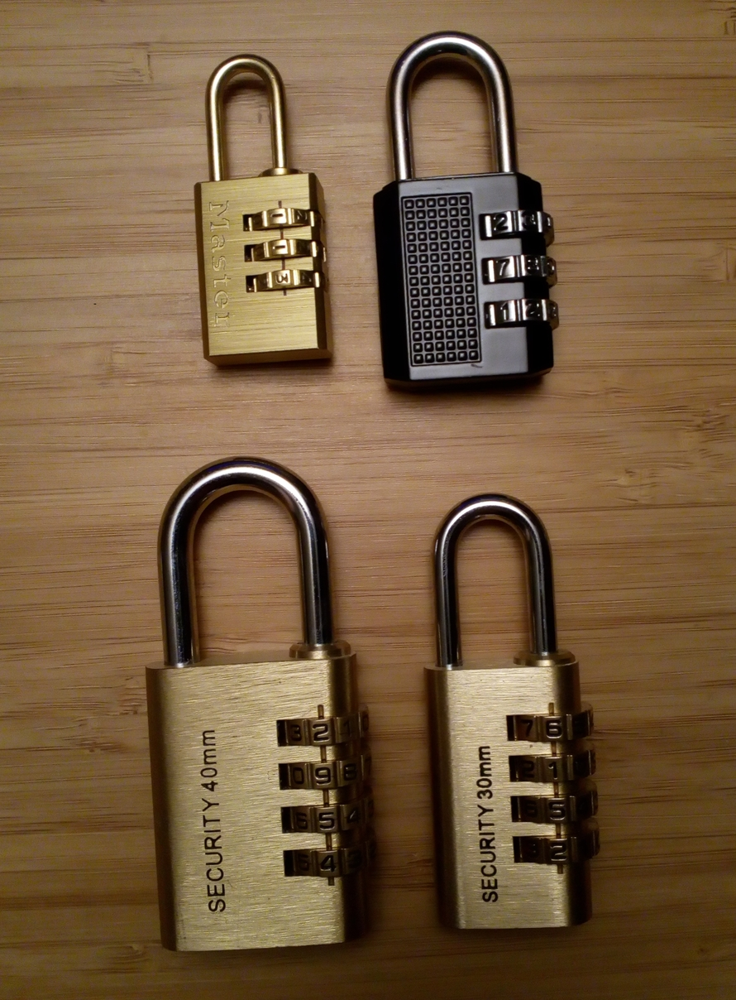

=========================
Opening combination locks
=========================

Introduction
============

Combination locks are very common even in high-security environment. And
sometimes we "forget" the combination. Everybody knows that given enough time
it's possible to just try every possibility or bring big pliers. However I'd
like to share some methods to open those locks much faster and without any
tool.

This is what we'll be opening:

So as you can see very common locks, I'm sure you have some of them lying
around. We'll be focusing on locks with 3 and 4 discs. Nothing foolproof I
fear, but hopefully it should get your school locker open.

The human factor
================

A lock with 3 discs that each have 10 possible digits will have 10³=1000
different combinations. If a combination was chosen at random that means
that we have a chance in one thousand to find the right combination on our
first try.

Except it's never chosen at random. People want to remember their codes so
they will generally choose things with meaning to them.

Muscle memory
-------------

The first thing to do is always to note the combination you find the lock in.
I often find locks where only one disc was moved by one digit so that it
would appear lock but would be easy to unlock. And it turns out it is indeed!

Also many people do just do one or two "thumb rub" to the right. Try doing a
thumb rub in the other direction! It will probably not land just right, but
with a bit of fiddling right and left you may find the right combination. If
it doesn't work do another thumb rub and retry. There's not much point doing
it more than twice but it will sometimes allow you an easy win.

Common combinations
-------------------

The one question you must ask yourself is whether the lock has an odd or
even number of discs.

If there's an even number of discs, good for you. When faced with choosing a
4 or 6 digit combination most people will jump at the opportunity to use a
date. Try important dates you can think of, years from 1990 onward and
day/month combinations.

If the combination is odd, the chances of an aesthetic choice such as 111,
242 or 456 are more important. Also try the classic 007, people somehow feel
smart using it.

Three-discs locks
=================

You could just try every combinations, it should take you less than 10
minutes. But we can do better and reduce it to six or so combinations to test.

The idea is that in simple locks the discs rub more against one another when
they're in the good position, so we'll force them to rub and see where they
have the hardest time moving.

1. Pull quite strongly on the shackle. No need to break a finger but be
   really firm.

2. Turn gently the discs until you find the spot where you're having the
   hardest time moving them. If you lack experience do that one disc after
   the other: I generally operate bottom to top.

3. The top disc will often be the hardest one to feel, if that's the case
   just ignore it. The other two should have stopped a bit before of the
   right one, generally within 2 digits. Try them patiently. Don't keep
   pulling on the shackle as you try them, that may prevent the lock from
   opening.

4. If you tried all the nearest digits where you landed, record what the
   digits you stopped at were and try again. Even if you didn't stop at the
   right place the first time you should see a pattern emerge as you
   constantly feel more friction around certain numbers. This is where the
   combination is.

That's it. I generally open low-quality locks in about a minute (often less)
using this method.

Four-discs locks
================

First of all, try the three-discs method. It's rare but some four-digit locks
are built around the same model and will present the same issue.

Most of the time though you'll feel that if you try that method (pulling the
shackle and turning all discs) you'll quickly feel the discs stop with an
audible click, not stopped by friction but more as if they were stuck in a
socket. Releasing all tension on the shackle should free them but they'll
lock again soon after on another number if you try the same method.

This is by design as a way to prevent you from using the friction method. As
it turns out though, all hope is not lost as this also has a flaw that will
prove a tremendous advantage to your endeavor.

See, the positions at which the discs lock themselves are not random.
Although they do not correspond to the correct positions each disc stops in a
position of the same parity as the correct one. This may be easier with an
example.

I have here a lock whose combination is 2954 (top to bottom). The first
number (2) is even so the disc will lock at every even number. The second one
(9) is odd so the disc will lock at every odd number. Then 5, odd again, and
4, even.

Let's now change the combination. How can you attack that lock?

1. Pull on the shackle

2. "Thumb rub" all discs at once until they start stopping into their
   sockets.

3. Ounce's all of them are stopped look at their parity: 7740? Odd, odd, even,
   even.

4. Turn the discs one by one by two position each time to try all
   combinations that keep the same odd, odd, even, even structure.
   There are only 625 of them, so that's only about half as many combinations
   as on a 3-discs lock!

Once you're fine with that part, know that there's an extension to that
method to go even faster, and it's based on the good old friction principle.

1. Using the same method as before turn the discs until they all stop at
   their correct parity position.

2. Without pulling the shackle, try feeling the disc that is the hardest to
   move. I will be subtle but you can feel it rubbing a bit more than most
   others.

3. Move that disc by one digit in any direction and go back to step 2 until
   the lock opens.

This part is much harder and you should probably not lose your time trying it
on your first try, just go with testing all combinations of correct parity.
However once you've mastered it you'll be able to open most 4 digits locks
within a minute!

Conclusion
==========

Don't forget to note down the combination you found, it may very well be
reused somewhere else or provide a good insight into the conventions they use
that will give you access to more later on.

Also, don't open locks without permission from their owner. The goal of this
article is to help you if you forget a combination and teach that combination
locks do not provide strong security. Don't be the bad guy, it's never as
funny as it sounds.

That said, I hope these little tips will prove of some use to you.

Image sources
-------------

- Mako Mankanshoku straight from `Kill la Kill
  <https://en.wikipedia.org/wiki/Kill_la_Kill>`_

- https://safebooru.org/index.php?page=post&s=view&id=1219085

- https://cheezburger.com/8304355840/nui-fluttershy
