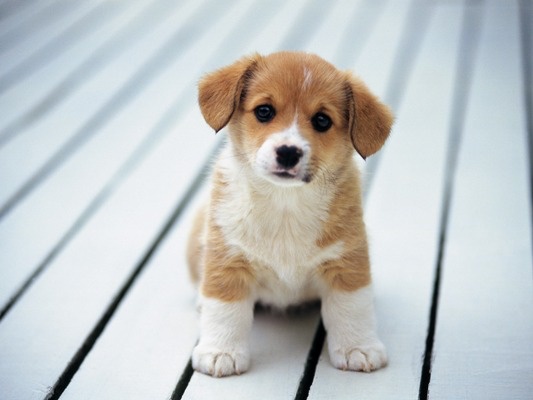

=============
Puppy writeup
=============

Introduction
============

Quelqu'un sur irc hier a proposé un `petit challenge de steganographie
<https://imgur.com/pb2jkGn>`_ pas méchant. La victime du jour ? Un chiot qui
renferme, nous dit-on, des secrets.

**puppy.png**

À la recherche d'un texte caché
===============================

Les deux formes les plus courantes d'information cachées dans une image sont:

- Du texte sous forme de commentaire ou autre
- Une autre image

Commençons par le texte. L'utilitaire ``strings`` permet de récupérer les
chaines de caractère présentes dans un binaire. La plupart sont le fruit de
coïncidences mais s'il y a du texte légitime non chiffré on devrait pouvoir
le retrouver.

.. code:: bash

    $ strings puppy.png

    IHDR
    sRGB

    ...

    )2DE2b
    __MACOSX/UX
    __MACOSX/Secret/UX
    __MACOSX/Secret/._skull.jpgUX
    cg`b`
    100.
    20h&
    QRR`
    L_7?
    KMS\
    Secret/Untitled.rtfUX
    __MACOSX/Secret/._Untitled.rtfUX
    cg`b`
    2+0tA
    Secret/UX
    Secret/skull.jpgUX
    __MACOSX/UX
    __MACOSX/Secret/UX
    __MACOSX/Secret/._skull.jpgUX
    Secret/Untitled.rtfUX
    __MACOSX/Secret/._Untitled.rtfUX

Visiblement ça n'a pas été inutile, on voit clairement des chemins de
fichiers présents dans l'image, et il semble que celle-ci ai été faite avec
un mac. On dirait que tout les chemins finissent par UX... Cela s'expliquera
sans doute par la suite. Avant cela, récupéront une liste plus propre:

.. code:: bash

    $ strings puppy.png | grep -e Secret -e MACOS

    Secret/UX
    Secret/skull.jpgUX
    __MACOSX/UX
    __MACOSX/Secret/UX
    __MACOSX/Secret/._skull.jpgUX
    Secret/Untitled.rtfUX
    __MACOSX/Secret/._Untitled.rtfUX
    Secret/UX
    Secret/skull.jpgUX
    __MACOSX/UX
    __MACOSX/Secret/UX
    __MACOSX/Secret/._skull.jpgUX
    Secret/Untitled.rtfUX
    __MACOSX/Secret/._Untitled.rtfUX

À la recherche d'un fichier caché
=================================

Regardons la liste de fichier que l'on a trouvé (moins les ``UX`` qui ne
semblent pas en faire partie au regard des extensions que l'on identifie).

::

    __MACOSX/
    __MACOSX/
    __MACOSX/Secret/
    __MACOSX/Secret/
    __MACOSX/Secret/._skull.jpg
    __MACOSX/Secret/._skull.jpg
    __MACOSX/Secret/._Untitled.rtf
    __MACOSX/Secret/._Untitled.rtf
    Secret/
    Secret/Untitled.rtf
    Secret/Untitled.rtf
    Secret/skull.jpg

Qu'est-ce qui pourrait motiver le fait d'avoir les différents noms de
fichiers et même de dossier ? Qu'est-ce qui a besoin de toute une structure
de fichier comme ça ? Peut-être un système de fichier. Ça pourrait être une
partition cachée qu'il faudrait extraire et monter... Ou alors une archive,
qu'il faudrait extraire et décompresser.

Il y a différents moyens de savoir, on se base généralement sur des calculs
d'entropie (l'idée étant qu'un fichier compressée va avoir une entropie
proche de 8 bits par octet alors que du texte non compressé en aura une plus
faible) mais c'est ici inutile. En effet, on voit que l'on cherche un fichier
jpg et un fichier rtf.

Le `format RTF <https://en.wikipedia.org/wiki/Rich_Text_Format>`_ est un
format textuel, donc si son contenu n'apparait pas dans strings c'est qu'il
est compressé. Ça pourrait être une archive compressée dans un système de
fichier, mais dans ce cas le nom de l'archive serait visible parmi les
fichiers trouvé et ce n'est pas le cas.

On est donc à la recherche d'une archive contenant une image et un texte.

À la recherche de l'archive cachée
==================================

Nous devons identifier l'archive parmi les informations binaires de l'image
et l'en séparer. Le soucis est que l'on ne sait pas où elle se trouve ni de
quel type d'archive il s'agit (tar.gz, zip, tar.bz2, ax, xz, 7z...).

Mais chaque chose en son temps : commençons par trouver ce fichier. Ici j'ai
continué l'analyse en utilisant l'outil de reverse engineering radare2.
Cependant j'aimerais montrer qu'il est possible de le faire avec des outils
plus communs. En contrepartie ça ne sera pas forcément aussi agréable qu'avec
des outils spécifiques.

Si l'on reprend le résultat original de ``strings`` on voit que le premier
nom de fichier était ``Secret/``. Cherchons où il se trouve. ``strings`` peut
donner les offsets des résultats avec ``--radix=x``.

.. code:: bash

    $ strings --radix=x puppy.png | grep Secret/ | head -1

      3d04d Secret/UX

Allons voir ce qui se trouve du côté de l'offset 0x3d04d du coup :

On peut utiliser hexdump ou xxd (qui vient avec vim) pour obtenir une
représentation mi-hexadécimale, mi-ascii du contenu du fichier. Je vais
utiliser xxd ici.

.. code:: bash

    $ xxd puppy.png | head

    00000000: 8950 4e47 0d0a 1a0a 0000 000d 4948 4452  .PNG........IHDR
    00000010: 0000 0215 0000 0190 0802 0000 0096 1305  ................
    00000020: df00 0000 0173 5247 4200 aece 1ce9 0000  .....sRGB.......
    00000030: 0009 7048 5973 0000 0b13 0000 0b13 0100  ..pHYs..........
    00000040: 9a9c 1800 0040 0049 4441 5478 018c bd09  .....@.IDATx....
    00000050: 9264 3b92 5de9 5344 fe4c 9242 11ee ba17  .d;.].SD.L.B....
    00000060: d04b e8d5 b548 8b90 95ac fae1 639f 7b0f  .K...H......c.{.
    00000070: a00f 661e 3f8b 1a1e 3085 8e17 0a3c bcc1  ..f.?...0....<..
    00000080: ccdc 1fff afff fbff 797e 7e7e 7878 f80c  ........y~~~xx..
    00000090: bdc3 3c3e 3e7e 7d7d 3d7e 7e3d 3d3d d185  ..<>>~}}=~~===..

On veut les lignes autour de notre offset, en sachant que ces derniers sont
alignés sur 16 octets (donc finissent par un 0). On veut donc la ligne
commençant par l'offset 0003d040.

.. code:: bash

    # -B2 et -A2 pour avoir 2 lignes avant et après le résultat

    $ xxd puppy.png | grep -B2 -A2 "3d040:"

    0003d020: 3040 5060 7080 8887 8685 8483 8281 ff50  0@P`p..........P
    0003d030: 4b03 040a 0000 0000 00fb 081c 4700 0000  K...........G...
    0003d040: 0000 0000 0000 0000 0007 0010 0053 6563  .............Sec
    0003d050: 7265 742f 5558 0c00 378a df55 3a8a df55  ret/UX..7..U:..U
    0003d060: f501 1400 504b 0304 1400 0800 0800 9b92  ....PK..........

Si on a pas un peu l'habitude de regarder des fichiers binaires, on peut
passer à côté du caractère assez spécifique de ces quelques lignes. Il est
rare en effet de trouver autant d'octets nuls côte à côte au beau milieu d'un
fichier, et juste avant une chaîne de caractère ça fait fortement penser à un
header. Il semble que l'on ai trouvé un début, mais le début de quoi...

La plupart des headers commencent par une séquence bien définie à l'instar du
``8950 4e47 0d0a -> .PNG..`` des fichiers PNG que l'on peut voir sur notre
première utilisation de xxd. Cela permet de savoir à quel type de fichier on
a affaire. Ce numéro d'identification est souvent appelé **Magic Number**.

Allons faire un petit tour sur wikipedia pour voir les formats d'archive
compressés les plus communs et les nombres magiques correspondant.

Pour gzip, rien sur wikipedia, mais le lien vers la `RFC
<https://tools.ietf.org/html/rfc1952>`_ correspondante nous ammène à trouver
que le fichier doit commencer par ``1f8b``. On ne retrouve pas cela dans
notre header.

Pour le format `zip <https://en.wikipedia.org/wiki/Zip_(file_format)>`_ on
peut lire :

::

    Most of the signatures end with the short integer 0x4b50, which is stored
    in little-endian ordering. Viewed as an ASCII string this reads "PK", the
    initials of the inventor Phil Katz. Thus, when a .ZIP file is viewed in a
    text editor the first two bytes of the file are usually "PK".

Voilà qui est intéressant ! À l'offset 0x3d02f on voit effectivement PK ! Ce
serait donc le début d'une archive zip ? On va la séparer du fichier pour
voir.

À la recherche du fichier zip
=============================

On sait où le ficher commence mais pas où il termine. On va déjà enlever le
début. Pour cela, on va utiliser ``dd``. Cet utilitaire permet de faire des
copie binaires. On va lui dire d'écrire la fin du fichier **puppy.png** dans
le fichier **out.zip** en sautant 0x3d02f=249903 blocs de 1 octet.

.. code:: bash

    $ dd if=puppy.png skip=249903 bs=1 of=out.zip

    154934+0 records in
    154934+0 records out
    154934 bytes (155 kB) copied, 0.157568 s, 983 kB/s

    $ file out.zip

    out.zip: Zip archive data, at least v1.0 to extract

Testons ?

.. code:: bash

    $ unzip out.zip

    Archive:  out.zip
       creating: Secret/
      inflating: Secret/skull.jpg
       creating: __MACOSX/
       creating: __MACOSX/Secret/
      inflating: __MACOSX/Secret/._skull.jpg
      inflating: Secret/Untitled.rtf
      inflating: __MACOSX/Secret/._Untitled.rtf

On dirait que ça a marché :) Si on regarde dans l'archive on trouve bien une
image (qui ne contient rien d'autre... à moins que ? :p ) et un fichier rtf:

**Secret/Untitled.rtf**

.. code:: postscript

    {\rtf1\ansi\ansicpg1252\cocoartf1389
    {\fonttbl\f0\fswiss\fcharset0 Helvetica;}
    {\colortbl;\red255\green255\blue255;}
    \paperw11900\paperh16840\margl1440\margr1440\vieww10800\viewh8400\viewkind0
    \pard\tx566\tx1133\tx1700\tx2267\tx2834\tx3401\tx3968\tx4535\tx5102\tx5669 \
    \tx6236\tx6803\pardirnatural\partightenfactor0

    \f0\fs24 \cf0 The Codeword is:\
    \
    hunter2}

Et voici le flag ! **hunter2**

.. image:: ../image/secret_skull.jpg
    :width: 50%

.. raw:: pdf

    PageBreak

À la recherche de la méthode employée
=====================================

Comment est-il possible de mettre une archive ZIP dans un PNG sans endommager
ce dernier ? Comme souvent, la solution se trouve sur wikipedia, dans la
`spécification du format PNG <https://en.wikipedia.org/wiki/PNG_(file_format)>`_

On y apprend que ce format est constitué de sections juxtaposées, certaines
ayant un sens particulier signalées par un identificateur tel que ``IHDR`` ou
``IDAT``, la plupart comportant une partie de l'image à proprement parler.
Ces deux headers sont bien visibles dans notre première utilisation de xxd
qui montrait le début du fichier **puppy.png**. On y voit notamment ``IHDR``
qui débute le header du fichier et ``IDAT`` qui correspond au début de la
liste de sections de données.

Wikipedia nous apprend également que le header PNG ne comporte pas la taille
du fichier. Pour savoir où se trouve la fin, le format PNG utilise une
section spéciale dont l'identificateur est ``IEND``, tout ce qui est après
est ignoré. Où se trouve cette balise ?

.. code:: bash

    # -B2 et -A2 pour avoir 2 lignes avant et après le résultat

    $ xxd puppy.png | grep -B2 -A2 "IEND"

    0003cff0: 4226 8e55 656c 13c5 8e0c 6383 dc06 49f4  B&.Uel....c...I.
    0003d000: 0d4a 0b89 0c31 e0ff 0112 a1e6 4b9d 14ec  .J...1......K...
    0003d010: f000 0000 0049 454e 44ae 4260 8200 1020  .....IEND.B`... 
    0003d020: 3040 5060 7080 8887 8685 8483 8281 ff50  0@P`p..........P
    0003d030: 4b03 040a 0000 0000 00fb 081c 4700 0000  K...........G...

On voit qu'il y a environ 20 octets entre le ``IEND`` et l'offset 0x3d02f où
commence notre fichier ZIP avec ``PK``. Ces octets ne semblent pas avoir de
raison d'être ici, c'est sans doute du bruit placé là pour séparer les deux
fichiers. On en a la confirmation si on observe attentivement là séquence
commençant à 0x3d01d : 0x00, 0x10, 0x20, ... 0x80 puis 0x88, 0x87, 0x86 ...
0x81 et finalement 0xff qui vient finir cette section de bruit. Bien trop peu
aléatoire pour être un hasard si vous voulez mon avis !

Ainsi ce challenge tire parti du fait que le format PNG ignore tout ce qui se
trouve après une balise ``IEND`` pour, tout simplement, placer un fichier
supplémentaire (en laissant un peu d'espace, sans doute pour faciliter la
manipulation).

On peut reproduire la manipulation avec un simple cat:

.. code:: bash

    $ cat image_normale.png fichier.zip > image_truquée.png

Aurait-on pu aller plus vite ?
==============================

Oui. Dès que l'on a eu l'idée que le fichier caché puisse être un fichier ZIP
nous aurions pu lancer sans plus de civilités :

.. code:: bash

    $ unzip puppy.png

    Archive:  puppy.png
    warning [puppy.png]:  249903 extra bytes at beginning or within zipfile
      (attempting to process anyway)
       creating: Secret/
      inflating: Secret/skull.jpg
       creating: __MACOSX/
       creating: __MACOSX/Secret/
      inflating: __MACOSX/Secret/._skull.jpg
      inflating: Secret/Untitled.rtf
      inflating: __MACOSX/Secret/._Untitled.rtf

Comment cela est-il possible ? De la même manière que le format PNG indique
son commencement par la séquence d'octets ``8950 4e47 0d0a`` soit ``.PNG..``
le format ZIP commence par la séquence ``504b 0304``. Dans le cas où cette
séquence n'apparaît pas au début du fichier, ``unzip`` va la chercher puis
ignorer tout ce qui se trouve avant pour essayer de décompresser la suite.
Comme (c'est un hasard) cette séquence n'apparait pas dans l'image, lancer
unzip sur l'image directement suffit à décompresser les fichiers.

Voilà qui conclue cette étude d'un challenge qui sans être particulièrement
difficile permet de mettre en évidence des techniques intéressantes.
