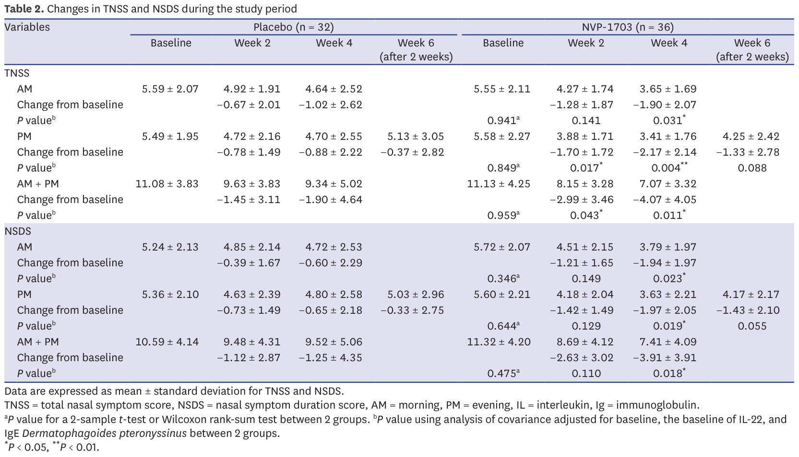
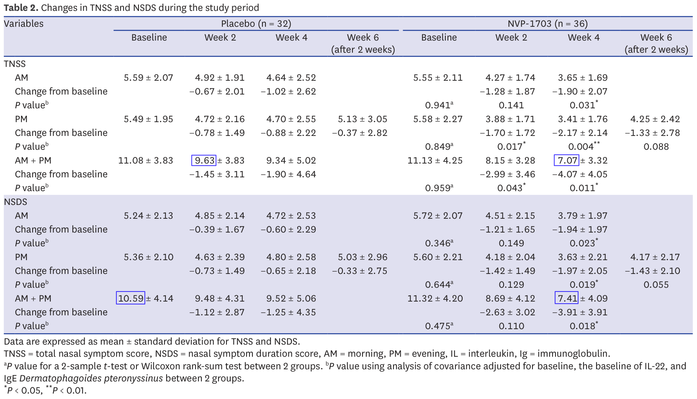
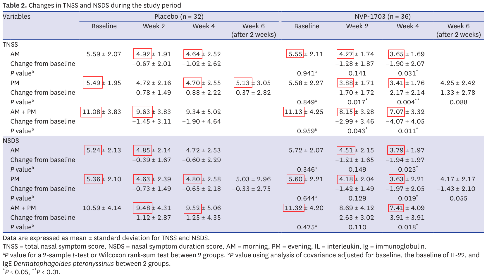
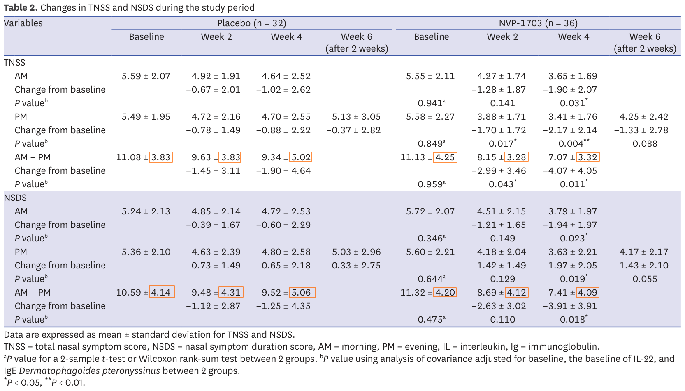
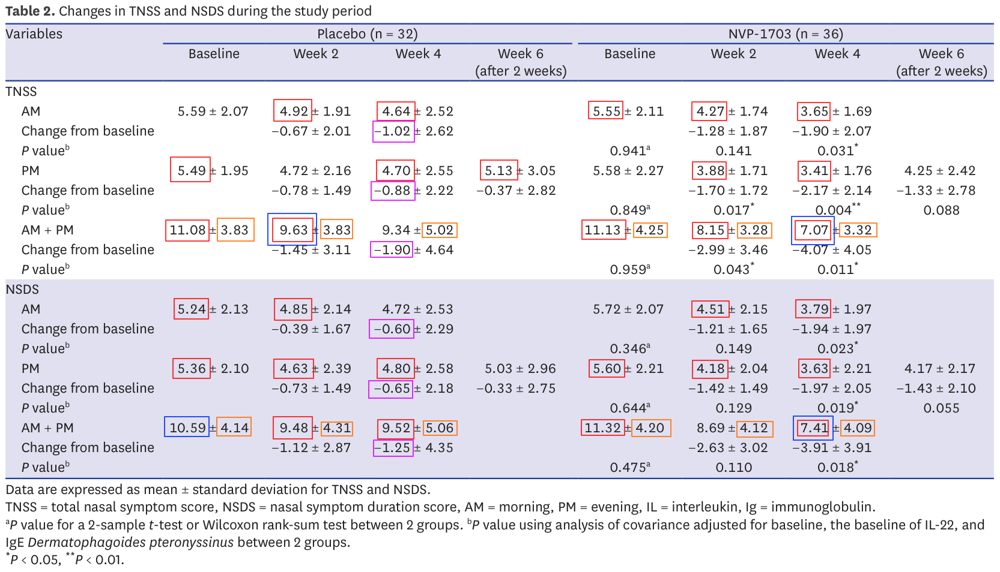

================================================
Suspicious Statistics in Allergic Rhinitis Study
================================================

What is this about?
===================

I like reading scientific papers. I find that it is a good way to train the
science muscle. Of course, I'm no biologist, so I can only comment in a
limited way on these topics. I do however enjoy a good occasion to do some
math so statistics-heavy papers are right up my alley. In particular,
randomized controlled trials (RCT).

In case you're not familiar with scientific lingo, a RCT is an experiment in
which the scientists create a *controlled* environment where everything is
the same for all participants except for a given stimulus (ex: getting a
medicine or a placebo) and which participant gets which is determined
*randomly*. It is generally considered one of the very best ways to identify
the effect of a stimulus and, if an effect is shown, can therefore be a
strong piece of evidence in favor of the effectiveness of the studied
stimulus.

On the 21st of October 2024, the Journal of Korean Medical Science published
the article *Efficacy of Bifidobacterium longum and Lactobacillus plantarum
(NVP-1703) in Children With Allergic Rhinitis: A Randomized Controlled Trial*
(https://doi.org/10.3346/jkms.2024.39.e266). It can be found online here:
https://jkms.org/pdf/10.3346/jkms.2024.39.e266

The idea behind the paper is that kimchi (a Korean cabbage dish) is
apparently traditionally thought to help with allergic rhinitis (hey fever).
The researchers identified two probiotics that might be at the source of the
alleged beneficial effects of kimchi: bifidobacterium longum and
lactobacillus plantarum. The goal here was to test whether they have an
effect on children with allergic rhinitis using a double-blind, placebo-based
random controlled trial. This is interesting!

Looking at the statistics however, it clearly became clear that something was
amiss. On the surface, the tools used are normal and they produce significant
results (which means that it would have been very unlikely to observe these
results by pure chance if the thing studied actually had no effect at all).
When looking closer though, it was all over the place. I found
inconsistencies leading to more inconsistencies, to the point where no single
mistake or bad data handling could explain it all. And that's what I want to
write about today.

I'll take you through the main results, the inconsistencies, and what
happened as a result of this analysis (spoiler, not much). It's going to be
quite different from regular computer security content, but I do
think that the techniques and approaches will be beneficial to a wider
audience and I'll make sure that the math is accessible to everyone.

- `Prelude: understanding the results <#prelude-understanding-the-results-1>`_

- `Issue 1: invalid changes from baseline
  <#issue-1-invalid-changes-from-baseline-1>`_

- `Issue 2: invalid sums of means <#issue-2-invalid-sums-of-means-1>`_

- `Issue 3: impossible means <#issue-3-impossible-means-1>`_

- `Issue 4: improbable standard deviations
  <#issue-4-improbable-standard-deviations-1>`_

- `Conclusion <#conclusion-1>`_

Prelude: understanding the results
==================================

We'll focus our attention on Table 2 which summarizes the results of the
study. Understanding this is really important so we'll take some time to make
sure everything is clear.

So, what is this table telling us? We have two main columns (Placebo and
NVP-1703) divided in 4 columns each, and 2 main lines (TNSS and NSDS) divided
in 3 lines each. The two columns indicate whether the result is from the
placebo group (control group) or the one getting the medicine (intervention
group). Subdivisions show results in time. For each group we see how many
participants are part of the group (32+36=68 in total).

TNSS (Total Nasal Symptom Score) and NSDS (Nasal Symptom Duration Score) are
a bit more obscure. These are two diagnostics tests to describe how strong
nasal symptoms are in a patient. They correspond to questionnaires such as
`this one
<https://sternsinus.com/wp-content/uploads/2021/03/TNSS-Evaluation-Sheet.pdf>`_
where we have questions such as "Does the patient has a runny nose? No
symptoms: 0, Mild symptoms 1, Moderate symptoms 2 or Severe symptoms 3". Then
we add all these scores and get a global score.

For each test we see 3 sections: AM, PM and AM+PM. These correspond to the
evolution of symptoms in the morning, evening and overall day. For each
period we see 3 lines:

* AM/PM/AM+PM

* Change from baseline

* P value

The first line presents two statistics: the mean total score value for the
group (so take all TNSS in the placebo group for example and average them) as
well as the standard deviation of the results from this mean (how spread out
the results are around the mean).

The second line presents the change from baseline: it's the difference
between the currently measured value and the value measured on the first day
before medicine or placebo had the opportunity to have any effect. We see the
difference between the means and a standard deviation. These changes from
baseline are later the basis for the computation of significance (P value).

The last line is the P value. This is a very common value in statistics as it
informs significance. Taking the example of the TNSS AM baseline, we see that
the baseline in the NVP-1703 group is 5.55 when it's 5.59 for the placebo
group. Since we're at the very beginning, it's expected that there will be
little difference between the two groups. Here, a P value of 0.941 means
"Assuming that the medicine has no effect and any difference is due to chance
alone, then the probability of observing a difference at least this big
between the two groups is 94.1%. And since that probability is higher than
the 5% threshold we previously decided in the paper, we can say that this
difference could very well be due to pure chance: the result is not
significant."

The hope of any RCT paper is to be able to show many significant differences
between their medicine and the placebo as such significant results are
indicators that the difference is unlikely to be due to chance (and since the
only difference between the groups is supposed to be the medicine, the
implication is that the medicine is working). In order to facilitate
identifying such significant results in the table, these P values are marked
with one or more asterisk.

It's worth noting that there is more than one way to compute a P value from a
group of statistics, but we won't delve into the technical details here and
will just assume that the test they choose is good and well used. Also, when
reading such papers it's important not to focus too much on p values.
Demonstrating that an effect is unlikely to be due to chance is one thing,
but it's also important to consider things like the effect size: if the
medicine consistently reduces nasal syndrome, but all it does is make you
sneeze one less time each day, then the effect is probably not important
enough to justify commercialization. Again, we'll gloss over that aspect
here. And finally, we could ask many more methodology questions such as
whether it's really relevant to expect a difference between morning and
evening in a process that we're following over more than a month. But my goal
here is to focus on the mathematics and I think we're at last well equipped
to do so.

Issue 1: invalid changes from baseline
======================================

We saw that table 2 provides changes from baseline. These are the main
statistics on which the the paper's results stand. In all cases
the change from baseline should be the difference between the baseline mean
and the studied mean. It's a simple subtraction.

However this turns out not to be always the case in the paper :

- Control TNSS week 4 AM: 4.64-5.59 = -0.95 ≠ -1.02
- Control TNSS week 4 PM: 4.70-5.49 =  ≠ -0.88
- Control TNSS week 4 AMPM: 9.34-11.08 = -1.74 ≠ -1.9
- Control NSDS week 4 AM: 4.72-5.24 = -0.52 ≠ -0.6
- Control NSDS week 4 PM: 4.80-5.36 = -0.56 ≠ -0.65
- Control NSDS week 4 AMPM: 9.52-10.59 = -1.07 ≠ -1.25

.. figure:: ../image/allergic_rhinitis_table_2_issue_1.png
    :width: 100%

This impacts 21.4% of the results. It is worth noticing that all of week 4 for
the control group and only that is impacted. Week 4 also happens to be the
week with the majority of significant results in this table.

This is obviously odd as you would expect subtractions to present much fewer
mistakes, and you would expect genuine mistakes to be spread evenly across
all results, not present for every result on week 4 of the control group and
only those.

So, this is weird, but there may be a legitimate explanation. After all a
single table rarely gives the full story of an entire study. Maybe some
patients dropped out of the control group and they based their computation on
a different baseline that only included the remaining participants? But then
week 6 should also be off (it technically is for TNSS as
5.13-5.49 = -0.36 ≠ 0.37 but such a small difference can be a rounding
error). So, weird result when it counts most, but there may be a legitimate
reason. Let's continue.

Issue 2: invalid sums of means
==============================

Table 2 provides the results of TNSS and NSDS evaluations for morning,
evening and overall day. We can expect the sum of morning and evening to make
up the entire day. This means that normally the sum of the mean over morning
and the one over evening should be equal to the mean over the entire day
(remember that the mean is the sum of all data points, divided by the number
of points).

This turns out not to be the case in 4 instances (33.3%):

- Control TNSS week 2: 4.92 + 4.72 = 9.64 ≠ 9.63
- Control NSDS baseline: 5.24 + 5.36 = 10.60 ≠ 10.59
- Treatment TNSS week 4: 3.65 + 3.41 = 7.06 ≠ 7.07
- Treatment NSDS week 4: 3.79 + 3.63 = 7.42 ≠ 7.41

The sums are not far from the expected ones, but nevertheless incorrect.
Again, we're talking about simple addition here so it is strange. However,
the mistakes are very small so it may just be due to rounding. I don't
consider them very suspicious, but let's keep them in mind.

Issue 3: impossible means
=========================

Now we get to the fun ones. The TNSS presented in Table 2 is the sum of 4
evaluations ranked from 0 to 3. These are integers, and therefore the TNSS
should be an integer as well. The same is true for the NSDS.

This matters because not all values are possible for means of integers. This
insight is the key behind the GRIM test
(https://doi.org/10.7287/peerj.preprints.2064v1).

The test is best explained by hand with an example. First a reminder: to
compute a mean, we divide the sum of individual results by the number of
results. It follows that if we have a mean and the number of results over
which it was computed, then their product gives the sum of individual
results.

Now, let's say we have a mean of 5.49, computed over 32 TNSS scores. Since the
scores are integers, the sum must be an integer as well. What was it?

5.49×32=175.68 which isn't an integer. This isn't unexpected: the numbers we
have are probably rounded. The sum must have been either 175 or 176.

- If it is 175, then 175/32 = 5.468… ~ 5.47 when rounding to 2 decimals
- If it is 176, then 176/32 = 5.5 exactly

Neither is equal to 5.49 and there is no reason to round them up or down to
5.49 from 5.47 or 5.5. There is therefore no integer sum that, divided by 32,
gives a mean of 5.49: this value is impossible for a mean over 32 integers.

Of course it can be the result of many different common mistakes: bad range
of values in an excel sheet, mistakes in copy, unreported change in sample
size… A few mistakes are perfectly reasonable and are not, on their own, a
sign of data manipulation.

In this case it is worth noting that 72.5% of all reported means in table 2
suffer from this issue. Almost 3 reported results in 4 is impossible.
Here they are in red in the table:

Making a few mistakes is possible, but this many is strange and it could be a
sign of data manipulation. Several cases of fraud have been identified
through this technique in the past. Yet, let's keep an open mind and wait
until the end: this is very suspicious but not necessarily damning.

Issue 4: improbable standard deviations
=======================================

In issue 2 we discussed the fact that there is a strong link between the
means of morning, afternoon and overall day measurements. For the same reason
the variances of these measurements (how spread they are around the mean)
should also be correlated although this correlation is much less direct than
simple addition.

To test this relationship, I wanted to ask the following question: assuming
that both AM and PM outcomes are normally distributed, how likely are we to
get an AM+PM distribution with the observed standard deviation?

Assuming normal distribution essentially means that the results are centered
around the mean. It's important because knowing the mean and standard
deviation entirely defines a normal distribution, so we can sample random
data points from it that match the statistical characteristics of the
original data. So what we can do now is say "OK, we don't have the original
data to check that AM+PM properly includes AM and PM. But we know that they
correspond to 32 data points (for the control group) taken from a known
distribution. So if we take 32 points at random from the AM distribution,
then 32 points from the PM distribution, how likely are we to get a new
distribution with the observed standard deviation?".

I therefore decided, for each day, to sample randomly from
the morning and evening distributions, combine them into an overall day
dataset and compute the standard deviation of this combined sample. By doing
this several thousand times we can identify the distribution of probability
corresponding to the standard deviation. I then computed the P value for the
reported standard deviation over the computed distribution of standard
deviations in order to know how likely we are to observe such a difference
through luck alone. Finally we adjust them to be two-tailed P values and for
multiple comparisons using the Benjamini-Hochberg procedure (because `it's
important to be careful when comparing many separate significance tests
<https://xkcd.com/882/>`_). Results with an adjusted P value below 0.05 are
considered significant.

Here are the results (some variation is expected from random sampling):

.. csv-table:: SD checks
    :header: "Test","Expected SD","Reported SD","Raw P value","Adjusted P value"
    :widths: 30 20 20 20 25

    "control TNSS week 0",2.85 ± 0.36,3.83,0.00334,0.0112
    "control TNSS week 2",2.89 ± 0.37,3.83,0.00560,0.0112
    "control TNSS week 4",3.58 ± 0.46,5.02,0.0008,0.0112
    "control NSDS week 0",3.00 ± 0.38,4.14,0.00136,0.0112
    "control NSDS week 2",3.21 ± 0.41,4.31,0.00362,0.0112
    "control NSDS week 4",3.61 ± 0.47,5.06,0.00091,0.0112
    "treatment TNSS week 0",3.11 ± 0.37,4.25,0.00105,0.0112
    "treatment TNSS week 2",2.46 ± 0.30,3.28,0.00273,0.0112
    "treatment TNSS week 4",2.45 ± 0.30,3.32,0.00174,0.0112
    "treatment NSDS week 0",3.03 ± 0.36,4.20,0.00067,0.0112
    "treatment NSDS week 2",2.97 ± 0.35,4.12,0.00059,0.0112
    "treatment NSDS week 4",2.97 ± 0.35,4.09,0.00079,0.0112

As we see, all adjusted P values are below 0.02. According to our 5%
standard, all these differences are significant, meaning that they're
unlikely to be the product of luck alone. All reported standard deviations
are therefore improbable.

Here is a visual representation of these results showing in each case the
distribution of standard distributions we observed through sampling several
thousand times and as a red line the reported standard deviation. The numbers
are slightly different from the ones above since they correspond to two
different batches of sampling, but you'll find at the end the code to
generate everything yourself and see that these results are coherent with
each other.

.. figure:: ../image/allergic_rhinitis_rplots.png
    :width: 100%

Here are the impacted results from table 2:

Now there is one important caveat to this angle: we treated AM and PM data
sets as independent, but they're not and it is possible that the observed
standard deviation isn't, indeed, the product of chance but that it is not
the product of data manipulation either. Maybe there is something in the
AM/PM relationship that makes such a combined standard deviation more
probable. But at the moment I don't have any concrete element to assume so.
This means that these results are suspicious, but that we should keep an open
mind as there may be an underlying reason as to why it came out this way.

Conclusion
==========

Combining all our issues, table 2 looks like this:

Almost every statistics reported presents an issue if not several. I
mentioned several times that it's important not to jump to conclusions, and I
stand by that statement. Some of these issues could very well have benign
explanations. Others like impossible means (in red) are more difficult to
justify, especially so when the impacted statistics happen to be the very
ones on which the validity of the report stands.

To clarify these points I tried contacting the authors and asking for raw
data since the paper includes a Data Availability Statement. I received no
response. I also brought these points to the journal on two separate
occasions. Again, no response. Since neither seem to think that there is an
issue, I suppose it's OK for me to publish this.

Every element of the data analysis can be replicated using `this R script
<../file/allergic_rhinitis_data_analysis.r>`_ and `this data file
<../file/allergic_rhinitis_data.csv>`_.

Timeline
--------

- 2024-10-25: Mail to the authors

- 2024-10-29: Mail to the journal with initial questions

- 2024-11-07: Mail to the journal with structured report

- 2025-06-16: Publication

