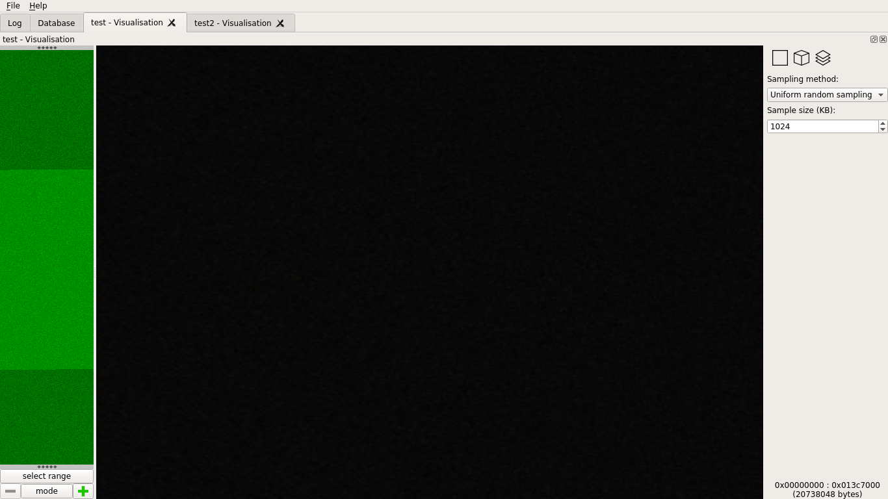
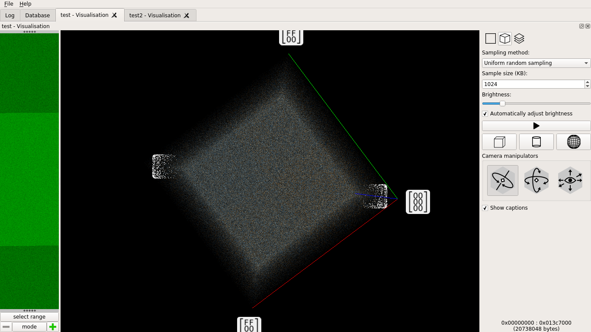
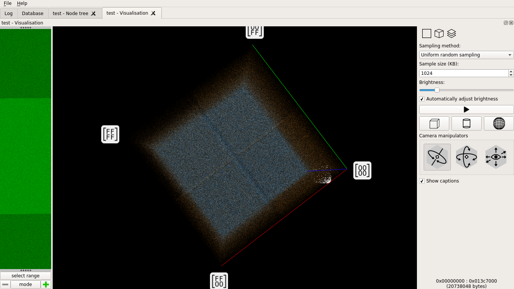

================================
How secure is unpredictableSeed?
================================

tl;dr
=====

- D's unpredictableSeed isn't unpredictable enough for cryptographic purpose
- We'll crack a pseudo-random generator to crack a (fictive) website
- To know what to do about it, jump at the end

The origins of the problem
==========================

I like D_ very much. It is a great, powerful and safe language. While it may
be a tad complex at times it does a good job at providing a language that
works, is fast and does not let you screw things up as fast and easily as C.

.. _D: https://dlang.org/

This is why I find myself recommanding to use it (or Rust, or Go, or Python,
or Java, anything with at least bound-checking really) for all new projects
involving user data.

A common class of projects using user data is web programming. We do a lot to
protect our users and website informations. Many protections are based on
some kind of randomness: generating random passwords, hashing salts, cookie
access tokens, mail validation tokens.

However D doesn't have a standard Cryptographically Secure Pseudo-Random
Number Generator (CSPRNG) yet. A common way within the community to secure
the PRNG is to reseed it regularly using an unpredictableSeed_. Actually I
even see many projects re-seeding their PRNG at each use.

.. _unpredictableSeed: https://dlang.org/library/std/random/unpredictable_seed.html

The problem with constant reseeding is apparent if you imagine that only
three possible seeds are possible. Given the following code, how many
different tokens can you generate?

.. code:: java

    uint mockUnpredictableSeed() {
        import std.random: uniform;
        return uniform(0, 3);
    }

    auto newToken() {
        auto rnd = Random(mockUnpredictableSeed());
        return rnd.front;
    }

Right, as for each seed the first output value is deterministic only three
tokens can be generated. By constantly reseeding you are delegating any
random-generation work to the seed generation algorithm. The PRNG you
actually use doesn't matter the slightest.

But this is no problem in practice right? Surely there is more than three
possible seeds. Well it is time to have a real look at how secure those
"unpredictable seeds" are.

Randomness evaluation
=====================

I first generated a random sample. Raw bytes are easier to reason about than
integers in this case:

.. code:: java

    /* gen_stream_1.d */
    void main() {
        import std.stdio: writef;
        import std.random: unpredictableSeed;

        while (true) {
            uint s = unpredictableSeed;
            for (int i=0; i<4; i++) {
                writef("%c", cast(char)(s >> 8.i));
            }
        }
    }

A bit of dd and we had a 20M file to play with:

.. code:: sh

    rdmd gen_stream_1.d | dd bs=2048 count=10240 of=test_1.raw

The first thing I do when evaluating randomness is plot a graph of the
sample. I like Veles_ very much for that. It is a tool that allows you to
generate digrams and trigrams of data in order to see it under different
angles (quite literraly). Any kind of schema would imply a correletation
between bytes that are supposed not to have any (that is the most basic
definition of random).

.. _Veles: https://codisec.com/veles/

I won't go into much details about how these representations work because
`they do it better than me
<http://codisec.com/binary-visualization-explained/>`_, but it is necessary
to understand the basics to interpret what is at play.

Veles proposes three kinds of representations:

- Digrams: Take bytes two by two, plot the point on a orthogonal plane,
  the first byte being the x coordinate and the other one the y.

- Trigram: Take bytes three by three, plot the point in space. Different
  coordinate systems are proposed but we'll stick with the good old
  orthogonal one.

- Layered Digram: Chunk your input, for each chunk draw the digram, then
  superpose all digrams to build a cube.

The layered digram is especially interesting because it combines the
simplicity of the digram with a "temporal" approach: if the first half of the
file is made of 1 and the second half is made of 0 a digram would just show
us two dots while a layered digram would show us two broken lines, one at the
start of the file for 1, the other at the end for 0.

It's easier with images so let's get to it ;) I used plain screenshots
because I found that even the simplest crop was generating unwanted patterns.
I advise opening the images in other tabs in order to see for yourself the
patterns that may grow from the noise.

Digram
------

The digram is fine, exactly what we would expect from such a random
distribution: no value or set of value seems less used than another.

Trigram
-------

The trigram looks also fine at first but with some specific angle we can see
a cross dividing the cube's face into four squares... It is very faint, but
maybe with another representation...

Layered digram
--------------

Yes, there is definitely a pattern there.

And things go even worse when rotating the cube: there is a clear layer that
has a different repartition. Both layers look fine independently but such a
pattern indicates a real bias in randomness.

.. image:: ../image/test_1_ldigram.png

So it's not as random as it was expected to be, but by how much?

Stepping through the code
=========================

unpredictableSeed is defined in std.random:

.. code:: java

    /**
    A "good" seed for initializing random number engines. Initializing
    with $(D_PARAM unpredictableSeed) makes engines generate different
    random number sequences every run.

    Returns:
    A single unsigned integer seed value, different on each successive call
    */
    @property uint unpredictableSeed() @trusted
    {
        import core.thread : Thread, getpid, MonoTime;
        static bool seeded;
        static MinstdRand0 rand;
        if (!seeded)
        {
            uint threadID = cast(uint) cast(void*) Thread.getThis();
            rand.seed((getpid()+threadID) ^ cast(uint)MonoTime.currTime.ticks);
            seeded = true;
        }
        rand.popFront();
        return cast(uint) (MonoTime.currTime.ticks ^ rand.front);
    }

As we can see it embeds the Minimal Standard RNG (MinstdRand0) seeded it with
the time and other process-specific values. Each unpredictableSeed is just a
random number from this PRNG xored with the current time.

For general purpose it is fine. But used directly for cryptographic purposes
it is catastrophic because it is entirely predictable: any value is just the
previous one times 16807 modulo 2147483647.

.. note::

    In other word if the attacker is able to find one output of the PRNG any
    further output is just a multiplication away.

Still, it can't be that bad right? After all we are not presenting the raw
output of the PRNG, we xor it with the current time and pass it through
another PRNG before presenting it to the user right?

We'll deal with each of these issues in a moment, but first let's illustrate
more litterally the relation between MinstdRand0 and unpredictableSeed using
the same visualizations as before on a raw MinstdRand0 PRNG:

.. code:: java

    @property uint rand() @trusted
    {
        import std.random: MinstdRand0;
        import core.thread : Thread, getpid, MonoTime;
        static bool seeded;
        static MinstdRand0 rand;
        if (!seeded)
        {
            uint threadID = cast(uint) cast(void*) Thread.getThis();
            rand.seed((getpid()+threadID) ^ cast(uint)MonoTime.currTime.ticks);
            seeded = true;
        }
        rand.popFront();
        return cast(uint) rand.front;
    }

    void main() {
        import std.stdio: writef;

        while (true) {
            uint s = rand;
            for (int i=0 ; i<4 ; i++) {
                writef("%c", cast(char)(s >> 8*i));
            }
        }
    }

Digram
------

The bias is clearly visible here.

.. image:: ../image/test_2_digram.png

Trigram
-------

The cross is easier to see.

.. image:: ../image/test_2_trigram.png

Layered digram
--------------

And of course the result is also visible on the layered diagram.

.. image:: ../image/test_2_ldigram.png

However the sample doesn't exhibit the same temporal layers as before. What
we get from that is that when it comes to spectral repartition alone xoring
the current time does provide some entropy (the crosses are almost blurred
away). But it also added another strong temporal bias that we saw on the
first layered diagram.

Breaking the PRNG obfuscation
=============================

The first problem we'll tackle is that of the second PRNG that makes it
impossible to know the raw output of unpredictableSeed. As unpredictableSeed
is just an uint we have 2³² possibilities. On a modern computer it is a
matter of minutes to try all possibilities to find which seed gave us which
random number. The following code finds it in the brutest possible way:

.. code:: java

    import std.stdio;
    import std.random;

    auto copyState(uint origin) {
        for (uint i=1; i>0; i++) {
            if (origin == Random(i).front)
                return origin;
        }
        return 0;
    }

    void main(string[] args) {
        auto seed    = unpredictableSeed;
        auto jackpot = Random(unpredictableSeed).front;

        auto found = jackpot.copyState;
        assert(found == seed);
    }

Done, and independently of the actual PRNG used.

Breaking time
=============

So we are able to get the unpredictableSeed, but how do we go from there to
the actual state of MinstdRand0?

Well, there's nothing more predictable than the flow of time so we'll just
bruteforce it.

Let's imagine that we have a website that allows you to recover your password
by sending you a token by email.

.. code:: java

    class Website {
        import std.random: unpredictableSeed;

        ulong tries;
        uint  privateToken;

        this() {
            getPublicToken; // Seed unpredictableSeed
        }

        auto check(uint token) {
            tries++;
            return privateToken == token;
        }

        auto getPublicToken() {
            return unpredictableSeed;
        }

        void setPrivateToken() {
            privateToken = unpredictableSeed;
        }
    }

Here we recover exactly one token for ourselves before asking for the token
of another account that we never get of course. But we can try any number of
tokens until we find it and get access to the account.

We know that the time used to generate the unpredictableSeed is somewhere
between the time of the first call and the result of the second. We just have
to try any time inbetween and see where that leads us by trying any time
after that for the second token.

The following code demonstrates roughly the idea.

.. code:: java

    void main(string[] args) {
        import core.time;
        import std.stdio;
        import std.random: MinstdRand0;

        auto ws = new Website();

        auto before    = MonoTime.currTime.ticks;
        auto token = ws.getPublicToken;
        auto inbetween = MonoTime.currTime.ticks;
        ws.setPrivateToken;
        auto after     = MonoTime.currTime.ticks;

        foreach(baseTime ; before .. inbetween) {
            uint originalSeed = cast(uint) (baseTime ^ token);
            auto rnd = MinstdRand0(originalSeed);

            foreach (nextTime ; inbetween .. after) {
                uint expectedOutput = cast(uint) (rnd.front ^ nextTime);
                if (ws.check(expectedOutput)) {
                    writeln("Got it! ", expectedOutput,
                            " in ", ws.tries, " tries");
                    return;
                }
            }
        }
        writeln("Missed it...");
    }

There we go. On my computer I generally get the right token after something
like 30000 tries. It is a lot but not so much that it can't be done in
practice, especially since things like password recovery services generally
don't have any kind of limit.

Of course this isn't real life. In real life we get delay, we don't get the
exact output, we need to deal with the other PRNG that I conveniently left
out there as we already showed that it only adds time without adding
complexity. Also we measured ticks and not all computers tick the same way.
And ticks represent uptime, not actual time, so we'd have to find that out to
go from one to the other. There are lots of mitigation in real life.

But I hope this shows that it is a very dangerous thing to let your system's
security relie on such a mecanism. We are not talking about google cracking
SHA-1 with his supercomputers, but of cracking any account with only a few
hundred thousand requests. If the user of the account or a timeout mecanism
doesn't invalidate the token this attack can even be spread along a week or
so, making only a few thousand requests at a time.

So, what should we do?
======================

For cryptographic purpose use a cryptographically secure random number
generator like /dev/random on Linux, the more recent getrandom system call or
CryptGenRandom on Windows. Non-cryptographic PRNG like MinstdRand0 here are
designed to have a good spectral repartition, not to be unpredictable.

What is a cryptographic purpose? It's actually easy: any random number that
is used as a secret has a cryptographic purpose.

Also as we showed reseeding at each call is only making your actual random
number generator useless. A good rule of thumb is that if you want to
generate *n* values you need a PRNG with a period of at least *n²*. This also
means that if you have a PRNG with a period of *n²* you need to reseed it
about every *n* values to perpetuate its randomness properties.

I hope this helps push things in the good direction in the future.
